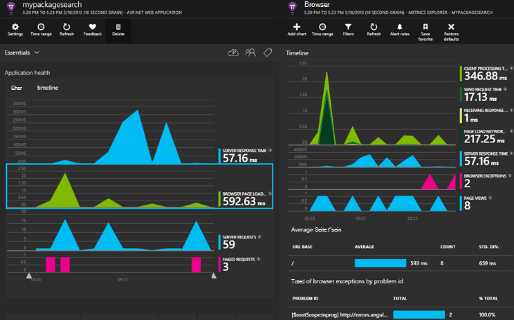

<properties 
    pageTitle="Anwendung Einblicke für ASP.NET Core" 
    description="Überwachen von ASP.NET-Webanwendungen für Verfügbarkeit, Performance und Nutzung." 
    services="application-insights" 
    documentationCenter=".net"
    authors="alancameronwills" 
    manager="douge"/>

<tags 
    ms.service="application-insights" 
    ms.workload="tbd" 
    ms.tgt_pltfrm="ibiza" 
    ms.devlang="na" 
    ms.topic="article" 
    ms.date="08/30/2016" 
    ms.author="awills"/>

# Anwendung Einblicke für ASP.NET Core

[Visual Studio Application Insights](app-insights-overview.md) können Sie Ihre Web-Anwendung für Verfügbarkeit, Performance und Auslastung zu überwachen. Das Feedback erhalten Sie über die Leistung und Effektivität Ihrer App im Umlauf, machen Sie überlegen, die Richtung des Entwurfs in jeden Entwicklungszyklus.

Sie benötigen ein Abonnement mit [Microsoft Azure](http://azure.com). Melden Sie sich mit einem Microsoft-Konto möglicherweise für Windows, XBox Live und anderen Microsoft-Cloud-Diensten. Das Team möglicherweise eine Organisationseinheit Azure-Abonnement: Bitten Sie den Besitzer mit Ihrem Microsoft-Konto hinzufügen.

## Erste Schritte

Führen Sie im [Handbuch Erste Schritte](https://github.com/Microsoft/ApplicationInsights-aspnetcore/wiki/Getting-Started).

## Mithilfe der Anwendung Einblicke

[Microsoft Azure-Portal](https://portal.azure.com) anmelden und Durchsuchen der Ressource erstellt, um Ihre Anwendung zu überwachen.

Verwenden Sie in einem separaten Browserfenster Ihrer app für eine Weile. Daten in den Application Insights-Diagrammen sehen. (Möglicherweise müssen auf Aktualisieren klicken.) Werden nur wenige Daten Wenn Sie entwickeln, aber diese Diagramme wirklich lebendig beim Veröffentlichen Ihrer app und viele Benutzer. 

Die Seite zeigt die Leistungsdiagramme Sie wahrscheinlich interessieren: Antwortzeit Seitenladezeit und Anzahl der fehlgeschlagenen Anfragen. Klicken Sie auf Diagramme mehrere Diagramme und Daten.

Ansichten im Portal lassen sich in zwei Hauptkategorien unterteilt:

* [Metrik-Explorer](app-insights-metrics-explorer.md) zeigt Diagramme und Tabellen von Metriken und zählt, wie Reaktionszeiten, Fehlerraten oder Metriken selbst mit der [API](app-insights-api-custom-events-metrics.md)erstellen. Filtern und Daten durch ein besseres Verständnis Ihrer app und Benutzer Eigenschaftswerte segmentieren.
* [Search Explorer](app-insights-diagnostic-search.md) listet einzelne Ereignisse wie Anfragen, Ausnahmen, Protokoll Spuren oder Ereignisse, die sich mit der [API](app-insights-api-custom-events-metrics.md)erstellt. Filtern und verwandte Ereignisse, um Themen Navigieren in den Ereignissen suchen.
* [Analytics](app-insights-analytics.md) können Sie die SQL-ähnliche Abfragen über Ihre Telemetrie und ist ein leistungsfähiges Tool für Analyse und Diagnose.

## Alarme

* Sie erhalten automatisch [proaktive Diagnose Alarme](app-insights-proactive-diagnostics.md) , die zu abweichenden Änderungen Fehler und andere mitteilen.
* Testen Sie Ihre Website kontinuierlich weltweit [Verfügbarkeitstests](app-insights-monitor-web-app-availability.md) eingerichtet und e-Mails erhalten, sobald einer der Test fehlschlägt.
* Richten Sie [metrische Warnungen](app-insights-monitor-web-app-availability.md) wissen geht wie Antwortzeiten oder Ausnahme Sätze außerhalb der zulässigen Grenzen ein.

## Weitere Telemetrie abrufen

* Seite Überwachung der Nutzung und Leistung [Telemetrie zu Ihren Webseiten hinzufügen](app-insights-javascript.md) .
* [Monitor Abhängigkeiten](app-insights-dependencies.md) auf REST, SQL oder andere externen Ressourcen Sie verlangsamt werden.
* [Verwenden der API](app-insights-api-custom-events-metrics.md) eigene Ereignisse und Metriken für eine detailliertere Ansicht der Performance und Nutzung Ihrer Anwendung.
* [Verfügbarkeitstests](app-insights-monitor-web-app-availability.md) überprüft Ihre app ständig aus der ganzen Welt. 

## Quelle öffnen

[Lesen und den Code zur](https://github.com/Microsoft/ApplicationInsights-aspnetcore#recent-updates)

