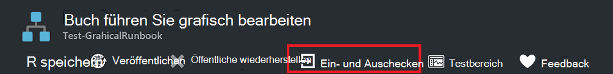
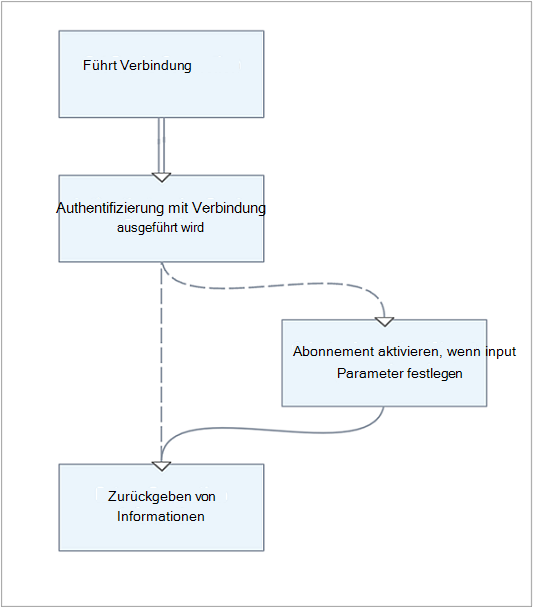
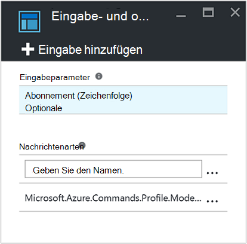
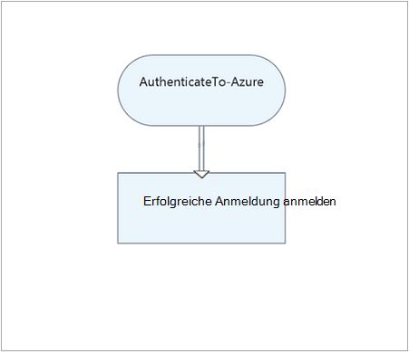
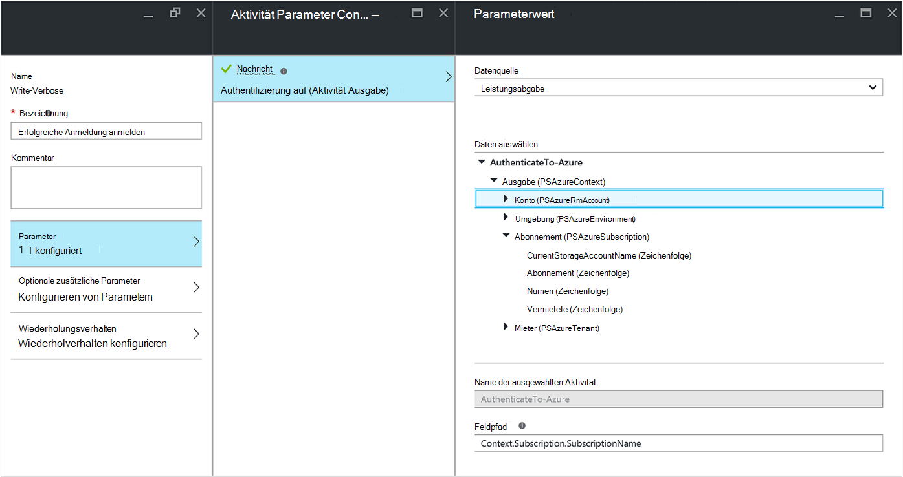
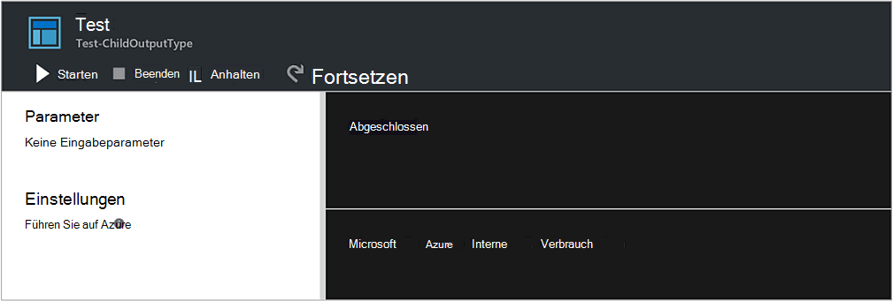
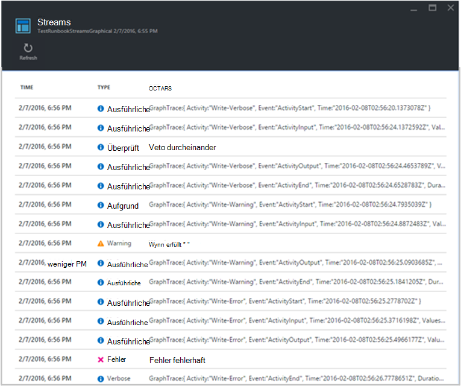
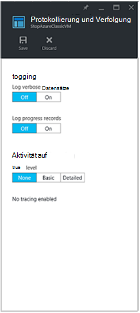

<properties
   pageTitle="Runbook Ausgabe und Nachrichten in Azure Automatisierung | Microsoft Azure"
   description="Beschreibt das Erstellen und Abrufen und den Fehlerinformationen von Runbooks in Azure Automation Nachrichten."
   services="automation"
   documentationCenter=""
   authors="mgoedtel"
   manager="jwhit"
   editor="tysonn" />
<tags
   ms.service="automation"
   ms.devlang="na"
   ms.topic="article"
   ms.tgt_pltfrm="na"
   ms.workload="infrastructure-services"
   ms.date="08/24/2016"
   ms.author="magoedte;bwren" />

# Runbook Ausgabe und Nachrichten in Azure Automation

Die meisten Azure Automatisierung Runbooks müssen gewisse Ausgabe wie eine Fehlermeldung an den Benutzer oder ein komplexes Objekt von einem anderen Workflow verwendet werden soll. Windows PowerShell bietet [mehrere Datenströme](http://blogs.technet.com/heyscriptingguy/archive/2014/03/30/understanding-streams-redirection-and-write-host-in-powershell.aspx) zur Ausgabe von einem Skript oder Workflow senden. Azure Automation arbeitet mit jeder dieser Streams anders, und befolgen Sie best Practices für die Verwendung jeder Erstellung ein Runbook.

Folgende Tabelle enthält eine kurze Beschreibung der einzelnen Streams und deren Verhalten im Azure-Verwaltungsportal, wenn veröffentlichte Runbook ausgeführt und wenn [ein Runbook testen](automation-testing-runbook.md). In den folgenden Abschnitten werden weitere jeder Stream bereitgestellt.

| Stream | Beschreibung | Veröffentlicht | Test|
|:---|:---|:---|:---|
|Ausgabe|Objekte soll von anderen Runbooks verwendet werden.|In den Auftragsverlauf geschrieben.|Im Ausgabebereich Test angezeigt.|
|Warnung|Warnung für den Benutzer vorgesehen.|In den Auftragsverlauf geschrieben.|Im Ausgabebereich Test angezeigt.|
|Fehler|Fehlermeldung für den Benutzer vorgesehen. Eine Ausnahme wird Runbook nach Fehlermeldung standardmäßig.|In den Auftragsverlauf geschrieben.|Im Ausgabebereich Test angezeigt.|
|Ausführliche|Nachrichten, die allgemein oder debugging-Informationen.|Auf Auftragsverlauf nur geschrieben, wenn die ausführliche Protokollierung für Runbooks aktiviert ist.|Im Testergebnis angezeigt, wenn $VerbosePreference im Runbook weiter festgelegt ist.|
|Fortschritt|Datensätze, die vor und nach jeder Aktivität im Runbook automatisch generiert. Runbooks sollten nicht versuchen, Fortschritt-Datensätze erstellen, da sie ein interaktiver Benutzer bestimmt sind.|Auf Auftragsverlauf nur geschrieben, wenn Fortschritte Protokollierung für Runbooks aktiviert ist.|Im der Ausgabe nicht angezeigt.|
|Debuggen|Nachrichten für ein interaktiver Benutzer. Sollte nicht in Runbooks verwendet werden.|Auftragsverlauf nicht geschrieben.|Ausgabebereich Test nicht geschrieben.|

## Ausgabe-stream

Der Ausgabestream dient zur Ausgabe von Objekten durch ein Skript oder Workflow erstellt korrekt ausgeführt wird. In Azure Automation wird dieser Stream hauptsächlich für Objekte, die von [übergeordneten Runbooks, die aktuelle Runbook aufrufen,](automation-child-runbooks.md)verwendet werden soll. Wenn wird Sie vom übergeordneten Runbook [Runbook Inline aufgerufen](automation-child-runbooks.md#InlineExecution) , Daten aus den Ausgabestream zum übergeordneten Element. Den Ausgabestream verwenden nur allgemeine Informationen für den Benutzer kommunizieren, wenn Sie wissen, dass Runbooks nie von einer anderen Runbook aufgerufen werden. Es wird empfohlen jedoch verwenden normalerweise [ausführliche Stream](#Verbose) Sie allgemeine Informationen für den Benutzer.

Sie können Daten in den Ausgabestream mithilfe von [Write-Output](http://technet.microsoft.com/library/hh849921.aspx) oder das Objekt in einer eigenen Zeile im Runbook schreiben.

    #The following lines both write an object to the output stream.
    Write-Output –InputObject $object
    $object

### Ausgabe von einer Funktion

Beim Schreiben in den Ausgabestream in einer Funktion, die in Ihrem Runbook enthalten, wird die Ausgabe an Runbooks übergeben. Wenn das Runbook Ausgabe einer Variablen zugewiesen, wird es nicht in den Ausgabestream geschrieben. Schreiben in alle anderen Datenströmen aus innerhalb der Funktion wird in den entsprechenden Stream Runbooks schreiben.

Betrachten Sie das folgende Beispiel für ein Runbook.

    Workflow Test-Runbook
    {
        Write-Verbose "Verbose outside of function" -Verbose
        Write-Output "Output outside of function"
        $functionOutput = Test-Function
        $functionOutput

    Function Test-Function
     {
        Write-Verbose "Verbose inside of function" -Verbose
        Write-Output "Output inside of function"
      }
    }

Der Ausgabestream Runbook dafür wäre:

    Output inside of function
    Output outside of function

Ausführliche Stream Runbook dafür wäre:

    Verbose outside of function
    Verbose inside of function

Sie haben einmal Runbooks veröffentlicht und vor dem start auch schalten Sie ausführliche Protokollierung in den Einstellungen Runbook um die ausführlichen Stream Ausgabe

### Deklarierenden Ausgabedatentyp

Ein Workflow kann Daten die Ausgabe mit dem [Attribut OutputType](http://technet.microsoft.com/library/hh847785.aspx)geben. Dieses Attribut hat keine Auswirkung, wenn während der Laufzeit, aber es zeigt Runbook Autor zur Entwurfszeit die erwartete Ausgabe des Runbooks. Das Toolset für Runbooks ständig wächst, steigt die Bedeutung der Ausgabe von Datentypen zur Entwurfszeit deklarieren Bedeutung. Daher ist es empfehlenswert, diese Deklaration in alle Runbooks enthalten, die Sie erstellen.

Hier ist eine Liste von Beispiel Ausgabetypen:

-   System.String
-   Int32
-   System.Collections.Hashtable
-   Microsoft.Azure.Commands.Compute.Models.PSVirtualMachine

  
Das folgende Beispiel für ein Runbook gibt ein Zeichenfolgenobjekt und enthält eine Erklärung der Ausgabetyp. Wenn Ihr Runbook ein Array eines bestimmten Typs gibt, sollten Sie weiterhin den Typ im Gegensatz zu einem Array des Typs angeben.

    Workflow Test-Runbook
    {
       [OutputType([string])]

       $output = "This is some string output."
       Write-Output $output
    }

Zum Deklarieren eines Ausgabetyps in Grapical oder grafisch PowerShell Workflow Runbooks können Sie die **Eingabe und Ausgabe** Menüoption und geben Sie den Namen der Typ auswählen.  Es wird empfohlen, den vollständigen Klassennamen .NET erkennbar machen verweisen auf von einem übergeordneten Runbook können.  Dies macht die Eigenschaften dieser Klasse Datenbus im Runbook und bietet viel Flexibilität beim für bedingte Logik, Protokollierung und als Werte für andere Aktivitäten im Runbook verwendet.  

Im folgenden Beispiel haben wir zwei grafisch Runbooks, dieses Feature zu veranschaulichen.  Wenden wir modulare Runbook Modell haben wir ein Runbook dient als *Authentifizierung Runbook Vorlage* verwalten Authentifizierung mit Azure mithilfe von Ausführen als Konto.  Unsere zweite Runbook, die normalerweise die grundlegende Logik zum Automatisieren eines bestimmten Szenarios ausgeführt werden, wird in diesem Fall die *Authentifizierung Runbook Vorlage* ausgeführt und die Ergebnisse in der Ausgabebereich **Test** .  Unter normalen Umständen würden wir diese Aktionen für eine Ressource nutzt die Ausgabe von untergeordneten Runbook Runbook haben.    

Hier ist die grundlegende Logik des **AuthenticateTo Azure** Runbooks.  .  

Sie enthält den Ausgabetyp *Microsoft.Azure.Commands.Profile.Models.PSAzureContext*, die die Authentifizierung Profileigenschaften zurück.   

Diese Runbooks sehr einfach ist, ist ein Konfigurationselement hier aufrufen.  Die letzte Aktivität **Write-Output** -Cmdlet ausgeführt wird, und schreibt die Profildaten in eine Variable $_ mit PowerShell-Ausdruck für den Parameter **Eingabeobjekt** für das Cmdlet.  

Für die zweite Runbook in diesem Beispiel mit dem Namen *Test ChildOutputType*haben wir einfach zwei Aktivitäten.   

Die erste Aktivität ruft **AuthenticateTo Azure** Runbook und die zweite Aktivität **Write-Verbose** -Cmdlet ausgeführt wird, mit der **Datenquelle** der **aktivitätsausgabe** Wert für **Feldpfad** ist **Context.Subscription.SubscriptionName**, die Ausgabe Kontext **AuthenticateTo Azure** Runbook angeben.      

Die Ausgabe ist der Name des Abonnements.  

Ein Hinweis über das Verhalten des Steuerelements Ausgabetyp.  Wenn Sie einen Wert im Feld Ausgabe auf die Eingabe und Ausgabe Eigenschaften eingeben, müssen Sie außerhalb des Steuerelements klicken nach dem eingeben, in der Reihenfolge für die Eingabe vom Steuerelement erkannt wird.  

## Nachrichtenströme

Im Gegensatz zu den Ausgabestream Nachrichtenströme soll Informationen für den Benutzer. Gibt es mehrere Nachrichtenströme für unterschiedliche Arten von Informationen und jede Azure Automatisierung anders behandelt wird.

### Warn- und Datenströme

Warn- und Streams soll ein Runbook Probleme anmelden. Sie werden in den Auftragsverlauf geschrieben, wenn ein Runbook ausgeführt und im der Ausgabe in Azure-Verwaltungsportal enthalten, wenn ein Runbook getestet wird. Standardmäßig wird das Runbook fortgesetzt nach einer Warnung oder Fehler. Sie können Runbooks auf eine Warnung oder einen Fehler angehalten werden soll, indem eine [Einstellungsvariable](#PreferenceVariables) im Runbook vor dem Erstellen der Nachricht festlegen. Beispielsweise um ein Runbook wie eine Ausnahme für Fehler unterbrechen, legen Sie **$ErrorActionPreference** anhalten.

Erstellen einer Warnung oder einen Fehler Nachricht Cmdlet [Schreiben Warnung](https://technet.microsoft.com/library/hh849931.aspx) oder [Fehler beim Schreiben](http://technet.microsoft.com/library/hh849962.aspx) . Aktivitäten können auch in diese Streams schreiben.

    #The following lines create a warning message and then an error message that will suspend the runbook.

    $ErrorActionPreference = "Stop"
    Write-Warning –Message "This is a warning message."
    Write-Error –Message "This is an error message that will stop the runbook because of the preference variable."

### Ausführliche stream

Die ausführlichen Strom ist für allgemeine Informationen zum Vorgang Runbook. Da [Debug-Datenstrom](#Debug) nicht in ein Runbook verfügbar ist, sollten ausführliche Nachrichten für Debuginformationen verwendet. Standardmäßig werden ausführliche Nachrichten veröffentlichten Runbooks nicht im Auftragsverlauf gespeichert. Ausführliche Nachrichten speichern, konfigurieren veröffentlicht Runbooks ausführliche Datensätze auf der Registerkarte Konfigurieren Runbook in Azure-Verwaltungsportal. In den meisten Fällen sollten Sie die Standardeinstellung nicht protokollierte ausführliche Datensätze für ein Runbook aus Leistungsgründen beibehalten. Aktivieren Sie diese Option nur zu beheben oder Debuggen ein Runbook.

Wenn [ein Runbook testen](automation-testing-runbook.md), ausführliche Nachrichten werden nicht angezeigt, auch wenn Runbooks ausführliche aufgezeichnet konfiguriert. Um ausführliche Nachrichten beim [Testen ein Runbook](automation-testing-runbook.md)anzuzeigen, müssen Sie die Variable $VerbosePreference weiter festlegen. Mit dieser Variable werden ausführliche Nachrichten im der Ausgabe der Azure-Portal angezeigt.

Erstellen Sie eine ausführliche Nachricht mit dem [Write-Verbose](http://technet.microsoft.com/library/hh849951.aspx) -Cmdlet.

    #The following line creates a verbose message.

    Write-Verbose –Message "This is a verbose message."

### Debuggen von Streams

Debug-Stream soll mit einem interaktiven Benutzer und sollte nicht in Runbooks verwendet werden.

## Fortschritt-Datensätze

Konfigurieren ein Runbook Fortschritt sich Datensätze (auf der Registerkarte Konfigurieren Runbook in Azure-Portal) und ein Datensatz in den Auftragsverlauf geschrieben, vor und nach jeder Aktivität ausgeführt wird. In den meisten Fällen sollten Sie die Standardeinstellung nicht Fortschritt Datensätze für ein Runbook protokollieren, um Leistung zu maximieren. Aktivieren Sie diese Option nur zu beheben oder Debuggen ein Runbook. Beim Testen eines Runbooks werden Fortschritt nicht angezeigt, auch wenn Runbooks Fortschritt aufgezeichnet konfiguriert.

[Write-Progress](http://technet.microsoft.com/library/hh849902.aspx) -Cmdlet ist ungültig in ein Runbook, da dies mit einem interaktiven Benutzer soll.

## Voreinstellung Variablen

Windows PowerShell verwendet [einstellungsvariablen](http://technet.microsoft.com/library/hh847796.aspx) , wie Daten an andere Ausgabe beantworten. Legen Sie diese Variablen in ein Runbook steuern, wie sie Daten in verschiedene Streams reagiert.

Die folgende Tabelle enthält die einstellungsvariablen Runbooks mit ihren gültigen und Standardwerte können. Beachten Sie, dass diese Tabelle nur die Werte enthält, die in ein Runbook gültig sind. Zusätzliche Werte gelten für einstellungsvariablen in Windows PowerShell außerhalb Azure Automatisierung verwendet.

| Variable| Standardwert| Gültige Werte|
|:---|:---|:---|
|WarningPreference|Weiter|Beenden Weiter SilentlyContinue|
|ErrorActionPreference|Weiter|Beenden Weiter SilentlyContinue|
|VerbosePreference|SilentlyContinue|Beenden Weiter SilentlyContinue|

In der folgenden Tabelle wird das Verhalten für die Einstellung Variable Werte gültig Runbooks aufgelistet.

| Wert| Verhalten|
|:---|:---|
|Weiter|Die Nachricht und setzt die Ausführung Runbooks.|
|SilentlyContinue|Runbooks ohne Protokollierung der Ausführung wird fortgesetzt. Dies wirkt sich die Meldung ignorieren.|
|Beenden|Die Nachricht und Runbooks hält.|

## Runbook Ausgabe und Nachrichten abrufen

### Azure-portal

Sie können die Details eines Auftrags Runbook in Azure-Portal auf der Registerkarte Aufträge ein Runbook anzeigen. Zusammenfassung des Auftrags kann die Eingabeparameter und den [Ausgabestream](#Output) neben allgemeinen Informationen über das Projekt und alle Ausnahmen anzeigen ihres Auftretens. Verlauf wird Nachrichten [Ausgabestream](#Output) und [Warnung und Fehlerstreams](#WarningError) [ausführlicher Stream](#Verbose) und [Fortschritt Datensätze](#Progress) einschließen, wenn Runbooks ausführlich protokollieren und Datensätze ausgeführt werden.

### Windows PowerShell

In Windows PowerShell können Sie Ausgabe und Nachrichten von ein Runbook mit dem Cmdlet [Get-AzureAutomationJobOutput](https://msdn.microsoft.com/library/mt603476.aspx) abrufen. Dieses Cmdlet benötigt die ID des Auftrags und hat ein Parameter Stream, in dem der Stream zurückgegeben angeben. Sie können zum Zurückgeben aller Streams für den Auftrag angeben.

Im folgende Beispiel wird ein Beispiel für ein Runbook und wartet auf den Abschluss. Abschluss der Auftrag der Ausgabestream entnommen.

    $job = Start-AzureRmAutomationRunbook -ResourceGroupName "ResourceGroup01" `
    –AutomationAccountName "MyAutomationAccount" –Name "Test-Runbook"

    $doLoop = $true
    While ($doLoop) {
       $job = Get-AzureRmAutomationJob -ResourceGroupName "ResourceGroup01" `
       –AutomationAccountName "MyAutomationAccount" -Id $job.JobId
       $status = $job.Status
       $doLoop = (($status -ne "Completed") -and ($status -ne "Failed") -and ($status -ne "Suspended") -and ($status -ne "Stopped")
    }

    Get-AzureRmAutomationJobOutput -ResourceGroupName "ResourceGroup01" `
    –AutomationAccountName "MyAutomationAccount" -Id $job.JobId –Stream Output

### Erstellen von Grafiken

Für Grafiken Runbooks steht zusätzliche Protokollierung im Formular Aktivität auf.  Zwei Ebenen der Protokollierung: Basic und detailliert.  In einfache Verfolgung Anfang sehen und Endzeit jeder Aktivität Runbook sowie Informationen zur Aktivität Wiederholungsversuche, wie versucht Startzeit der Aktivität.  In ausführlichen Protokollierung können Sie einfache Verfolgung plus Eingabe und Ausgabe von Daten für jede Aktivität.  Beachten Sie, dass derzeit Ablaufverfolgungsdatensätze werden mit ausführlichen Stream ausführliche Protokollierung, wenn Sie die Protokollierung aktivieren aktiviert werden müssen.  Für Grafiken Runbooks mit Tracing aktiviert entfällt Fortschritt Datensätze anmelden, da die grundlegenden denselben Zweck erfüllt und informativere ist.

Aus der obigen Abbildung finden Sie, wenn Sie ausführlich protokollieren und grafisch Runbooks tracing aktivieren, wesentlich mehr Informationen in der Job-Streams Ansicht verfügbar ist.  Diese zusätzlichen Informationen für ein Runbook produktionsprobleme beheben kann, und daher sollte nur aktiviert werden dazu und nicht grundsätzlich.    
Ablaufverfolgungsdatensätze kann besonders zahlreich.  Mit grafisch Runbook erhalten verfolgen Sie zwei Datensätze pro Aktivität abhängig davon, ob Sie Basic oder detaillierte Protokollierung konfiguriert haben.  Wenn Sie nicht diese Informationen für ein Runbook zur Problembehandlung verfolgen, möchten Tracing bleiben deaktiviert.

**So aktivieren Sie Aktivität auf.**

 1. Öffnen Sie in Azure-Verwaltungsportal Automation-Konto.

 2. Klicken Sie auf die Kachel **Runbooks** Runbooks öffnen.

 3. -Blade Runbooks klicken Sie grafisch Runbook aus der Runbooks.

 4. Klicken Sie auf Blatt Einstellungen für ausgewählte Runbook **protokollieren und verfolgen**.

 5. Für die Protokollierung und Verfolgung Blade klicken Protokoll ausführliche Datensätze **auf** ausführliche Protokollierung und Udner Aktivitätsebene Tracing ändern die Ablaufverfolgungsebene zu **einfach** oder **detailliert** verfolgen Sie anhand erfordern. 

    

## Nächste Schritte

- Mehr über Runbook Ausführung wie Aufträge Runbook überwachen und andere technische Details finden Sie unter [Nachverfolgen eines Auftrags runbook](automation-runbook-execution.md)
- Zu entwerfen und untergeordnete Runbooks, siehe [untergeordnete Runbooks in Azure Automation](automation-child-runbooks.md)
