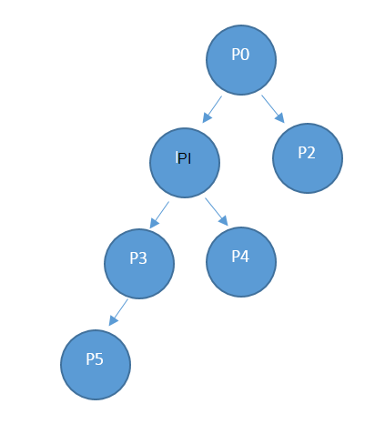

<properties
    pageTitle="Anbieter-Ressourcenverwendung API | Microsoft Azure"
    description="Referenz zum Ressourcenverbrauch-API die Azure Stapel Nutzungsinformationen abrufen."
    services="azure-stack"
    documentationCenter=""
    authors="AlfredoPizzirani"
    manager="byronr"
    editor=""/>

<tags
    ms.service="azure-stack"
    ms.workload="na"
    ms.tgt_pltfrm="na"
    ms.devlang="na"
    ms.topic="article"
    ms.date="10/18/2016"
    ms.author="alfredop"/>

# Anbieter-Ressourcenverwendung API

Der Begriff Anbieter gilt Dienstadministrator und delegierte Anbieter. Dienstadministratoren können delegierte Anbieter Anbieter Verwendung API und die Verwendung der direkten Mieter anzeigen. Z. B. P0 Provider-API Verwendungsinformationen P1s und P2 der direkten Nutzung zu erreichen und P1 können Verwendungsinformationen P3 und P4 fordern.

## API-Aufruf Referenz

### Anforderung

Die Anforderung wird Verbrauch Details die gewünschten Abonnements und den gewünschten Zeitrahmen. Es gibt keine Anforderung.

Diese Verwendung API ist eine API Anbieter, damit der Aufrufer eine Rolle Eigentümer, Teilnehmer- oder Lesezugriff des Anbieters Abonnement zugewiesen werden muss.

| **-Methode**  | **Anfrage-URI** |
| ------------ | ------------------------------------------------------------------------------------------------------------------------------------------------------------------------------------------------------------------------------------------------------------------------------------------------------ |
|  Erhalten        | https://{armendpoint}/subscriptions/{subId}/providers/Microsoft.Commerce/subscriberUsageAggregates?reportedStartTime={reportedStartTime}&reportedEndTime={reportedEndTime}&aggregationGranularity={granularity}&subscriberId={sub1.1}&api-version=2015-06-01-preview&continuationToken={token-value} |

### Argumente

| **Argument**              | **Beschreibung** |
| -------------------------- | --------------------------------------------------------------------------------------------------------------------------------------------------------------------------------------------------------------------------------------------------------------------------------------------------------------------------------------------------------- |
| *armendpoint*             | Azure Ressourcenmanager Endpunkt der Azure-Stack-Umgebung. Azure Stapel Konvention ist der Name des ARM-Endpunkt im Format https://api. {Domänennamen}'. Ist der Domänenname azurestack.local, werden der ARM-Endpunkt z. B. https://api.azurestack.local. |
| *subId*                   | Abonnement-ID des Benutzers, der den Aufruf ausführt. |
| *reportedStartTime*       | Startzeit der Abfrage. Der Wert für *' DateTime '* sollte in UTC und am Anfang der Stunde beispielsweise 13:00. Legen Sie diesen Wert auf Mitternacht UTC, tägliche Aggregation. Das Format ist ISO 8601, z. B. 2015-06-16T18 % 3a53 % 3a11 % 2b00 % 3a00Z, *geschützt* , Doppelpunkt, % 3a geschützt und plus ist % 2 b geschützt, sodass angezeigten URI ist. |
| *reportedEndTime*         | Endzeit der Abfrage. Die Integritätsregeln für *ReportedStartTime* gelten gelten auch für dieses Argument. Der Wert für *ReportedEndTime* darf nicht in der Zukunft sein. |
| *aggregationGranularity*  | Optionaler Parameter, der zwei separate mögliche Werte: täglich und stündlich. Wie die Werte in Tagesschritten Daten zurückgibt und das andere ist ein stündlicher Auflösung. Die Option "täglich" ist die Standardeinstellung. |
| *subscriberId*            | Abonnement-ID. Gefilterte Daten muss die Abonnement-ID eines direkten Mandanten des Anbieters. Wenn kein Abonnement-ID-Parameter angegeben ist, gibt der Aufruf Verwendungsdaten für direkte Mieter des Anbieters. |
| *API-version*             | Version des Protokolls für diese Anforderung verwendet wird. 2015-06-01-Vorschau verwenden. |
| *continuationToken*       | Token vom letzten Aufruf Verwendung API-Provider abgerufen. Dies ist erforderlich, wenn eine Antwort größer als 1.000 Zeilen. Dies ist das Lesezeichen für den Fortschritt. Sofern nicht vorhanden, Datenabruf ab dem Tag oder Stunde, basierend auf der Reihenfolge übergeben. |

### Antwort

Abrufen /subscriptions/sub1/providers/Microsoft.Commerce/subscriberUsageAggregates?reportedStartTime=reportedStartTime=2014-05-01T00%3a00%3a00%2b00%3a00 & ReportedEndTime = 2015-06-01T00 % 3a00 % 3a00 % 2b00 % 3a00 & AggregationGranularity = täglich & SubscriberId = Sub1.1 & API-Version = 1.0

{

"Wert":\[

{

"Id": "/subscriptions/sub1.1/providers/Microsoft.Commerce/UsageAggregate/sub1.1-

meterID1 ",

"Name": "sub1.1 meterID1"

"Typ": "Microsoft.Commerce/UsageAggregate"

"Eigenschaften": {

"SubscriptionId": "sub1.1"

"UsageStartTime": "2015-03-03T00:00:00 + 00:00",

"UsageEndTime": "2015-03-04T00:00:00 + 00:00",

"InstanceData": "{\\" Microsoft.Resources\\": {\\" ResourceUri\\":\\" resourceUri1\\",\\"Speicherort\\

":\\" Alaska\\",\\" Tags\\": null\\" AdditionalInfo\\": null}}",

"Menge":2.4000000000

"MeterId": "meterID1"

}

},

…

### Details der Antwort

| **Argument**       | **Beschreibung**
| ------------------ | ------------------------------------------------------------------------------------------------------------- |
| *ID*               | Eindeutige ID des Aggregats Verwendung
| *Name*             | Name des Aggregats Verwendung
| *Typ*             | Ressourcendefinition
| *subscriptionId*   | Abonnement-ID des Benutzers Azure Stapel
| *usageStartTime*   | UTC-Startzeit der Verwendung Bucket dieses Aggregat Verwendung gehört
| *usageEndTime*     | UTC-Endzeit der Verwendung Bucket dieses Aggregat Verwendung gehört
| *instanceData*     | Schlüssel-Wert-Paare Instanzdetails (in einem neuen Format):  *ResourceUri*: vollständig qualifizierte Ressourcen-ID, die Ressourcengruppen und den Instanznamen   *Ort*: Region, in dem dieser Dienst ausgeführt wurde,   *Tags*: Resource-Tags, die vom Benutzer angegeben   *AdditionalInfo*: Weitere details zu der Ressource, die verbraucht, z. B. Betriebssystem Version oder Bild |
| *Menge*         | Betrag der Ressourcenverbrauch, die in diesem Zeitraum aufgetreten |
| *meterId*          | Eindeutige Kennung für die Ressource, die verbraucht (auch als *ResourceID*) |

## Nächste Schritte

[Ressourcenverwendung Tenant-API-Referenz](azure-stack-tenant-resource-usage-api.md)

[Verwendung-bezogene häufig gestellte Fragen](azure-stack-usage-related-faq.md)
