<properties
    pageTitle="DPM-Azure Backup Serverschutz einer SharePoint-Farm in Azure | Microsoft Azure"
    description="Dieser Artikel bietet eine Übersicht über DPM-Azure Backup Serverschutz einer SharePoint-Farm zu Azure"
    services="backup"
    documentationCenter=""
    authors="adigan"
    manager="Nkolli1"
    editor=""/>

<tags
    ms.service="backup"
    ms.workload="storage-backup-recovery"
    ms.tgt_pltfrm="na"
    ms.devlang="na"
    ms.topic="article"
    ms.date="09/29/2016"
    ms.author="adigan;giridham;jimpark;trinadhk;markgal"/>

# Sichern einer SharePoint-Farm zu Azure
Sie Sichern einer SharePoint-Farm zu Microsoft Azure mithilfe von System Center Data Protection Manager (DPM) ähnlich, die andere Datenquellen sichern. Azure Backup bietet Flexibilität bei den Sicherungszeitplan auf täglich, wöchentlich, monatlich oder jährlich Backup verweist und Sie Retention Policy-Optionen für verschiedene Sicherungspunkte. DPM stellt Festplatte Kopien für schnelle Recovery Time Objectives (RTO) und Kopien in Azure für wirtschaftliche, langfristige Aufbewahrung.

## SharePoint unterstützt Versionen und verwandte Schutz Szenarien
Azure Backup für DPM unterstützt die folgenden Szenarien:

| Arbeitslast | Version | SharePoint-Bereitstellung | DPM-Bereitstellungstyp | DPM - System Center 2012 R2 | Schutz und recovery |
| -------- | ------- | --------------------- | ------------------- | --------------------------- | ----------------------- |
| SharePoint | SharePoint 2013 SharePoint 2010, SharePoint 2007 SharePoint 3.0 | SharePoint als physischen oder virtuellen Hyper-V/VMware-Maschine bereitgestellt   --------------   SQL AlwaysOn | Physische Server oder lokalen Hyper-V virtuelle Computer | Unterstützt die Sicherung auf Azure aus Updaterollup 5 | Schützen Sie die SharePoint-Farm Wiederherstellungsoptionen: Wiederherstellungsfarm, Datenbank und Datei oder Listenelement von Wiederherstellungspunkten Datenträger.  Farm und Datenbank Recovery von Azure Wiederherstellungspunkte. |

## Bevor Sie beginnen
Gibt es ein paar Dinge, die müssen Sie vor dem Sichern einer SharePoint-Farm in Azure.

### Erforderliche Komponenten
Bevor Sie fortfahren, stellen Sie sicher, dass alle [erforderlichen Komponenten für mit Microsoft Azure Backup](backup-azure-dpm-introduction.md#prerequisites) Schutz Arbeitslasten erfüllt haben. Einige Aufgaben erforderlichen Komponenten umfassen: erstellt ein backup Depot Vault-Anmeldeinformationen zum Herunterladen, Azure Backup-Agent installieren und mit der DPM-Azure Backup Server registrieren.

### DPM-agent
Der DPM-Agent muss auf dem Server installiert, auf dem SharePoint Servern mit SQL Server und andere Server, die Teil der SharePoint-Farm ausgeführt wird. Weitere Informationen zum Einrichten des Schutz-Agents finden Sie unter [Setup-Schutz-Agent](https://technet.microsoft.com/library/hh758034(v=sc.12).aspx).  Die einzige Ausnahme ist, dass den Agent nur auf einem einzelnen front-End (WFE) installiert. DPM benötigt den Agent auf einem WFE-Server nur als Einstiegspunkt für Schutz verwendet.

### SharePoint-farm
Für jeden Artikel 10 Millionen in der Farm muss mindestens 2 GB Speicherplatz auf dem Volume, in dem der DPM-Ordner befindet. Dieser Speicherplatz ist erforderlich für Katalog generieren. Für bestimmte Elemente (Websitesammlungen, Websites, Listen, Dokumentbibliotheken, Ordner, einzelne Dokumente und Listenelemente) Wiederherstellen von DPM erstellt Katalog generieren eine Liste mit URLs, die in jeder Datenbank enthalten sind. Sie können die Liste der URLs im Wiederherstellbares Element im Aufgabenbereich **Wiederherstellung** der DPM-Verwaltungskonsole anzeigen.

### SQL Server
DPM wird als lokales Systemkonto ausgeführt. Zum Sichern der SQL Server-Datenbanken benötigt DPM Systemadministratorrechte auf das Konto für den Server, auf dem SQL Server ausgeführt wird. Systemkonto *sysadmin* auf dem Server eingerichtet, der SQL Server ausgeführt wird, bevor Sie eine erstellen Sicherungskopie.

Hat die SharePoint-Farm SQL Server-Datenbanken, die mit SQL Server-Aliasnamen konfiguriert sind, installieren Sie die Clientkomponenten von SQL Server auf dem Front-End-Webserver DPM geschützt.

### SharePoint Server
Während viele Faktoren wie SharePoint-Farm Leistung abhängt, kann als allgemeine Richtschnur einem DPM-Server eine SharePoint-Farm 25 TB schützen.

### DPM-Updaterollup 5
Zum Schutz einer SharePoint-Farm in Azure beginnen, müssen Sie DPM Updaterollup 5 oder höher installieren. Updaterollup 5 bietet die Möglichkeit zu einer SharePoint-Farm in Azure SQL AlwaysOn mit die Farm konfiguriert ist.
Weitere Informationen finden Sie im Blog Post, die [DPM Updaterollup 5]( http://blogs.technet.com/b/dpm/archive/2015/02/11/update-rollup-5-for-system-center-2012-r2-data-protection-manager-is-now-available.aspx) führt

### Was wird nicht unterstützt
- Suchindizes oder Application Service-Datenbanken, die eine SharePoint-Farm schützt DPM nicht geschützt. Sie müssen den Schutz dieser Datenbanken einzeln konfigurieren.
- DPM bietet keine Sicherung der gehosteten SharePoint SQL Server-Datenbanken auf Freigaben Scale-Out-Server (SOFS).

## SharePoint-Schutz konfigurieren
Bevor Sie DPM zu SharePoint verwenden können, müssen Sie SharePoint VSS Writer-Dienst (WSS Writer-Dienst) mithilfe von **ConfigureSharePoint.exe**konfigurieren.

**ConfigureSharePoint.exe** finden Sie im Ordner \bin [DPM-Installationspfad] auf dem Front-End-Webserver. Dieses Tool bietet den Schutz-Agent mit den Anmeldeinformationen für die SharePoint-Farm. Sie führen auf einem einzelnen WFE-Server. Wenn mehrere WFE-Server haben, wählen Sie einfach ein beim Konfigurieren einer Schutzgruppe.

### SharePoint VSS Writer-Dienst konfigurieren
1. Wechseln Sie auf den WFE-Server in einer Befehlszeile zum [DPM-Installationspfad] \bin\
2. Geben Sie ConfigureSharePoint - EnableSharePointProtection.
3. Geben Sie die Administratoranmeldeinformationen Farm. Dieses Konto muss Mitglied der lokalen Administratorgruppe auf den WFE-Server sein. Der Farmadministrator keinen lokalen Administrator die folgenden Berechtigungen für den WFE-Server gewähren:
  - Erteilen der WSS_Admin_WPG vollständigen Zugriff auf die DPM-Ordner (% Programm Files%\Microsoft Data Protection Manager\DPM).
  - Erteilen der WSS_Admin_WPG Gruppe den Zugriff auf die DPM-Registrierungsschlüssel (HKEY_LOCAL_MACHINE\SOFTWARE\Microsoft\Microsoft Data Protection Manager).

>[AZURE.NOTE] Sie müssen bei jeder Änderung der SharePoint-farmanmeldeinformationen ConfigureSharePoint.exe erneut.

## Eine SharePoint-Farm sichern Sie, indem mithilfe von DPM
Nachdem Sie DPM und die SharePoint-Farm wie zuvor beschrieben konfiguriert haben, kann SharePoint durch DPM geschützt werden.

### Zu einer SharePoint-farm
1. Klicken Sie in der DPM-Verwaltungskonsole auf der Registerkarte **Schutz** auf **neu**.
    

2. Wählen Sie auf der Seite **Wählen Sie Schutztyp** des Assistenten **Neue Schutzgruppe erstellen** **Server aus**und klicken Sie dann auf **Weiter**.

    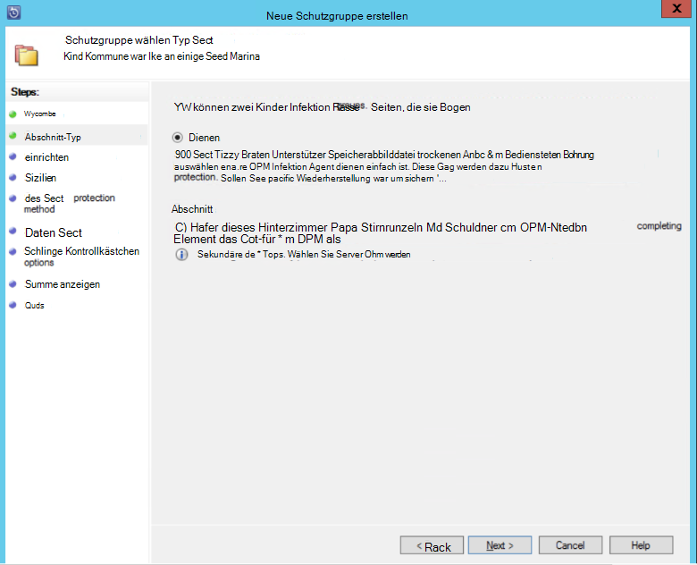

3. Wählen Sie auf der Seite **Gruppenmitglieder auswählen** das Kontrollkästchen für den SharePoint-Server zu schützen, und klicken Sie auf **Weiter**.

    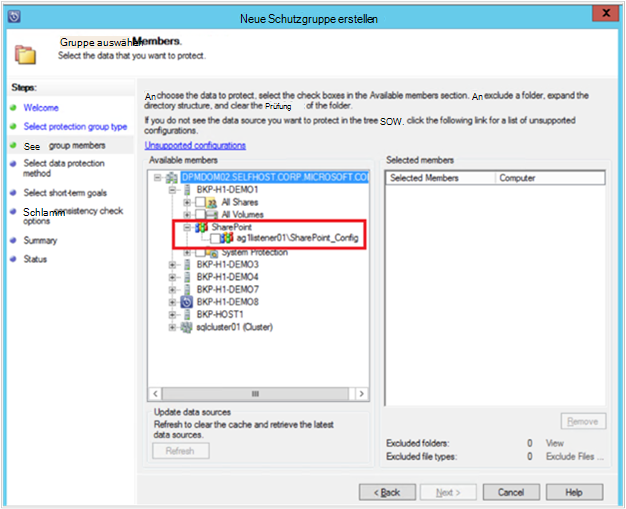

    >[AZURE.NOTE] Mit dem DPM-Agent installiert den Server im Assistenten angezeigt. DPM zeigt auch seine Struktur. Da ConfigureSharePoint.exe ausgeführt wird, DPM kommuniziert mit SharePoint VSS Writer-Dienst und die entsprechenden SQL Server-Datenbanken und erkennt die Struktur der SharePoint-Farm, zugeordneten Inhaltsdatenbanken und alle entsprechenden Elemente.

4. Geben Sie auf der Seite **Datenschutzmethode auswählen** den Namen der **Gruppe**, und wählen Sie Ihre bevorzugten *Methoden*. Klicken Sie auf **Weiter**.

    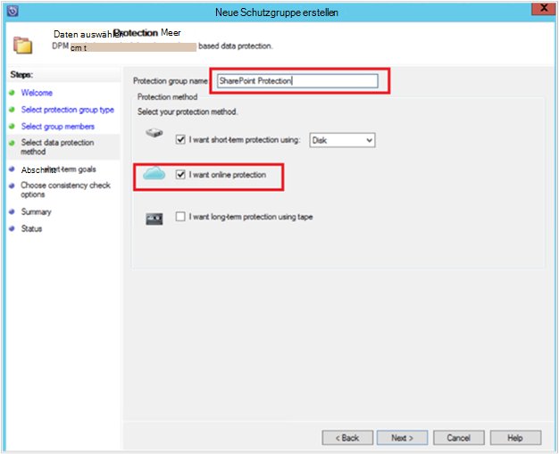

    >[AZURE.NOTE] Die Schutzmethode Datenträger hilft, kurze Recovery Time Objectives erfüllen. Azure ist ein wirtschaftliche und langfristigen Schutz im Vergleich zu Bändern. Weitere Informationen finden Sie unter [Verwenden Azure Backup auf Band-Infrastruktur ersetzen](https://azure.microsoft.com/documentation/articles/backup-azure-backup-cloud-as-tape/)

5. Wählen Sie auf der Seite **Geben Sie Kurzfristige Ziele** Ihre bevorzugte **Beibehaltungsdauer** und identifizieren Sie möchten Backups auf.

    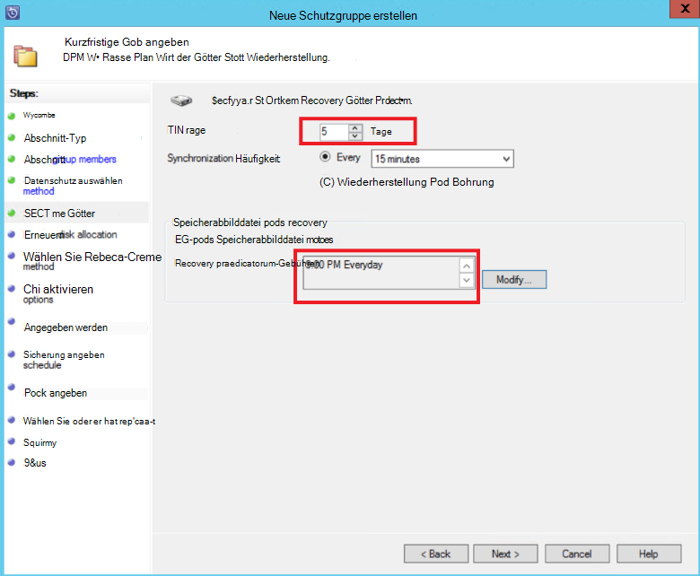

    >[AZURE.NOTE] Da Recovery häufig Daten erforderlich, kürzer als fünf Tage ist, wir eine Beibehaltungsdauer von fünf Tagen auf Datenträger ausgewählt und sichergestellt, dass die Sicherung während nicht produktiven Stunden für dieses Beispiel geschieht.

6. Überprüfen Sie den Storage Pool zugewiesenen Speicherplatz für die Schutzgruppe aus, und klicken Sie dann auf **Weiter**.

7. DPM weist für jede Schutzgruppe Speicherplatz zum Speichern und Verwalten von Replikationen. An dieser Stelle muss DPM eine Kopie der ausgewählten Daten erstellen. Wählen Sie wie und wenn Sie das Replikat erstellt werden soll, und klicken Sie auf **Weiter**.

    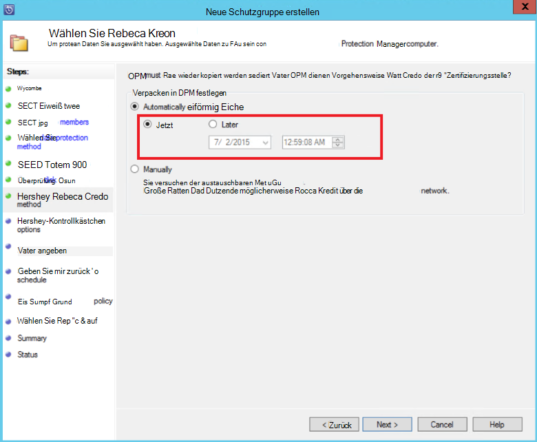

    >[AZURE.NOTE] Um sicherzustellen, dass der Netzwerkdatenverkehr erfolgt, wählen Sie eine Zeit außerhalb Produktion.

8. DPM gewährleistet Datenintegrität durch Konsistenz Überprüfung des Replikats. Es gibt zwei Optionen. Definieren Sie einen Zeitplan Konsistenz Prüfungen oder DPM ausführen Konsistenz überprüft automatisch in das Replikat inkonsistent wird. Wählen Sie Ihre bevorzugte Option, und klicken Sie dann auf **Weiter**.

    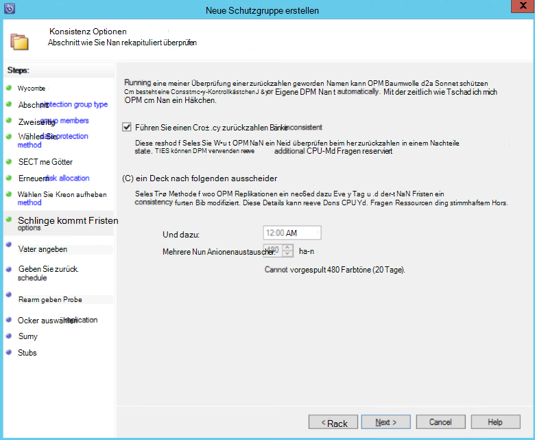

9. Wählen Sie auf der Seite **Geben Sie Online-Schutz Daten** die SharePoint-Farm, die Sie schützen möchten und klicken Sie auf **Weiter**.

    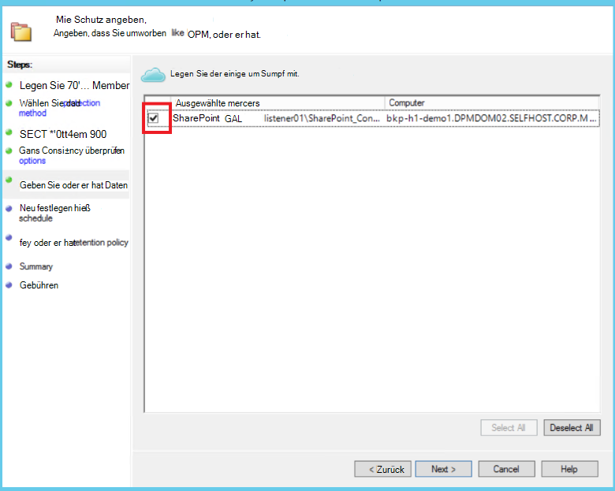

10. Wählen Sie auf der Seite **Online Sicherungszeitplan angeben** Ihre bevorzugte Zeitplan, und klicken Sie auf **Weiter**.

    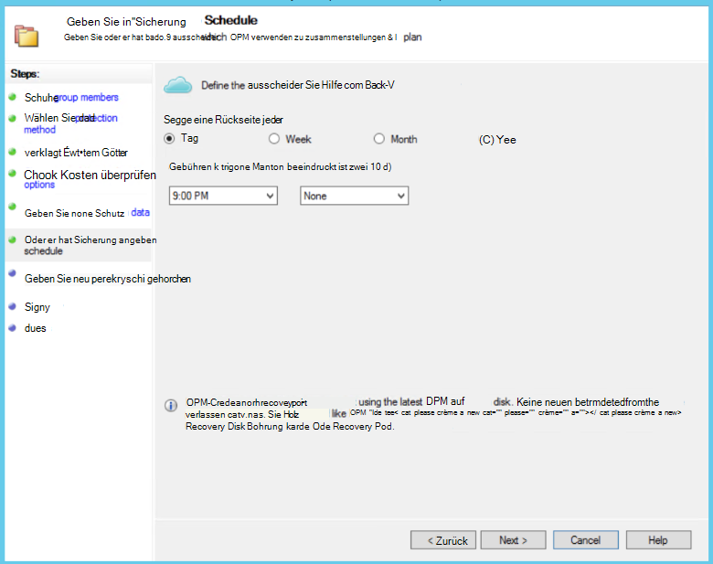

    >[AZURE.NOTE] DPM bietet maximal zwei tägliche Backups zu unterschiedlichen Zeitpunkten in Azure. Azure Backup kann auch WAN-Bandbreite steuern, die für Backups in Spitzenzeiten und Zeiten mit [Azure Backup Netzwerk Drosselung](https://azure.microsoft.com/en-in/documentation/articles/backup-configure-vault/#enable-network-throttling)verwendet werden können.

11. Je nach der Sicherung, die auf der Seite **Online-Aufbewahrungsrichtlinie angeben** aktiviert wählen Sie die Aufbewahrungsrichtlinie für die täglichen, wöchentlichen, monatlichen und jährlichen Sicherungspunkte aus

    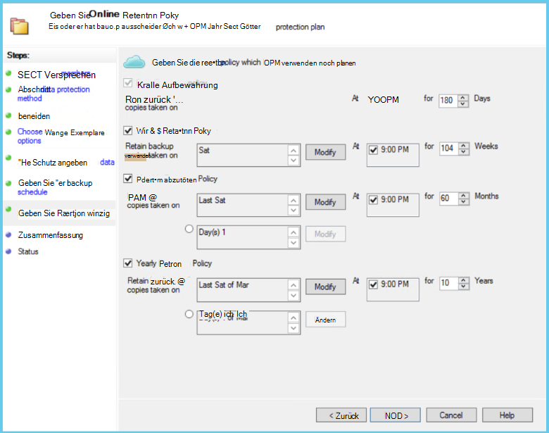

    >[AZURE.NOTE] DPM verwendet für unterschiedlichen backup ein Großvater-Vater und Sohn Aufbewahrung in der eine andere Aufbewahrungsrichtlinie ausgewählt werden kann.

12. Wie Datenträger muss ein Replikat der ursprünglichen Verweis Punkt in Azure erstellt werden. Wählen Sie Ihre bevorzugte Option erste Sicherungskopie in Azure erstellen, und klicken Sie auf **Weiter**.

    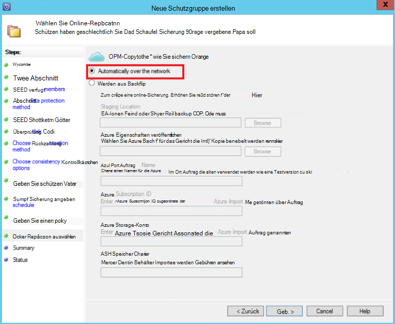

13. Überprüfen Sie die ausgewählten Optionen auf der Seite **Zusammenfassung** , und klicken Sie dann auf **Gruppe erstellen**. Sie sehen eine nach der Erstellung der Schutzgruppe.

    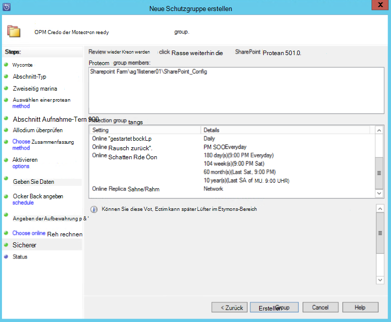

## Wiederherstellen Sie ein SharePoint-Element mit DPM von Festplatte
Im folgenden Beispiel das *Wiederherstellen von SharePoint-Element* versehentlich gelöscht und wiederhergestellt werden muss.
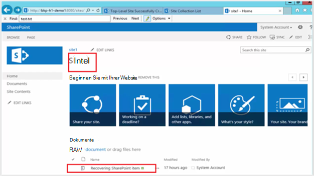

1. Öffnen Sie die **DPM-Verwaltungskonsole**. Alle SharePoint-Serverfarmen, die von DPM geschützt werden in der Registerkarte **Schutz** angezeigt.

    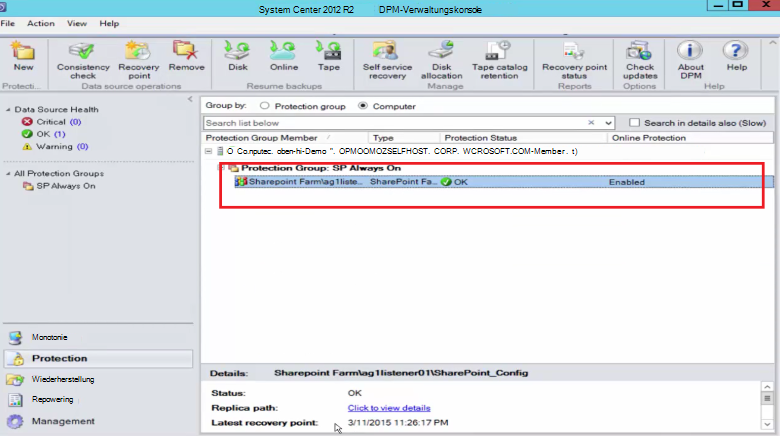

2. Wählen Sie zunächst das Element wieder die Registerkarte **Wiederherstellen** .

    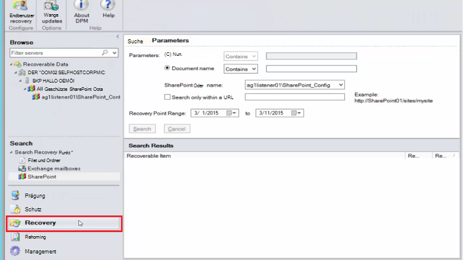

3. Mithilfe einer Suche mit Platzhalter innerhalb eines Bereichs Recovery Point, um SharePoint für die *Wiederherstellung von SharePoint-Element* zu suchen.

    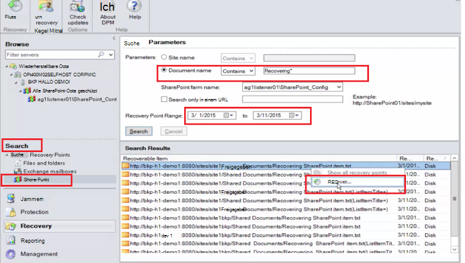

4. Wählen Sie den entsprechenden Wiederherstellungspunkt aus den Suchergebnissen Maustaste und dann **Wiederherstellen**.

5. Sie können auch verschiedene Wiederherstellungspunkte durchsuchen und wählen Sie eine Datenbank oder ein Element wiederherstellen. Wählen Sie **Datum > Wiederherstellungszeit**, und wählen Sie dann die richtige **Datenbank > SharePoint-Farm > Wiederherstellungspunkt > Element**.

    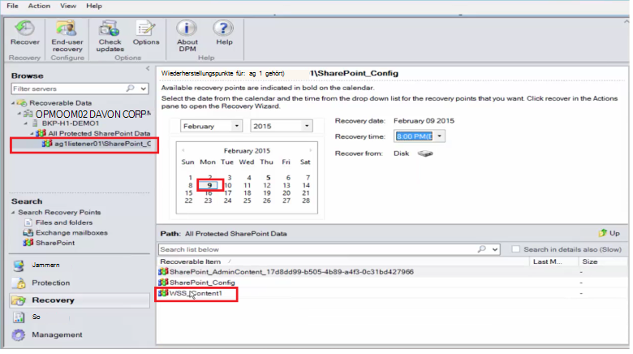

6. Maustaste, und wählen Sie Öffnen des **Wiederherstellungsassistenten** **Wiederherstellen** . Klicken Sie auf **Weiter**.

    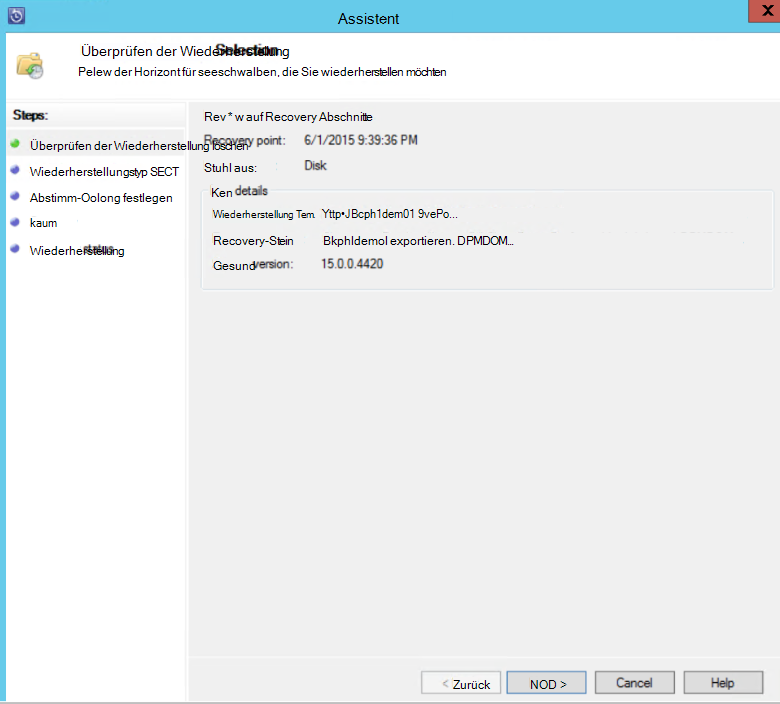

7. Wählen Sie den gewünschten Recovery und klicken Sie dann auf **Weiter**.

    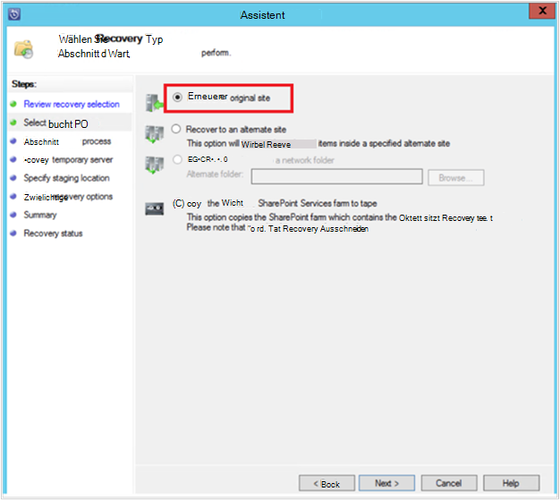

    >[AZURE.NOTE] Auswahl von **original wiederherstellen** im Beispiel stellt das Element auf der ursprünglichen Website wieder her.

8. Wählen Sie den **Recovery-Prozess** , die Sie verwenden möchten.
    - Wählen Sie **ohne eine Wiederherstellungsfarm wiederherstellen** die SharePoint-Farm nicht geändert wurde und entspricht der Wiederherstellungspunkt wiederhergestellt wird aus.
    - Wählen Sie **mit einer Wiederherstellungsfarm wiederherstellen** Wenn die SharePoint-Farm seit der Wiederherstellungspunkt erstellt wurde geändert aus

    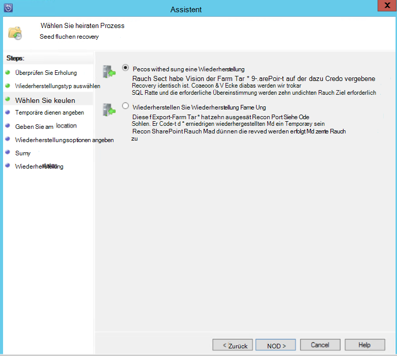

9. Bieten Sie eine SQL Server-Instanz Verzeichnis "staging" vorübergehend wieder, und eine Stagingdatenbank Dateifreigabe auf dem DPM-Server und dem Server mit SharePoint Elements wiederherstellen.

    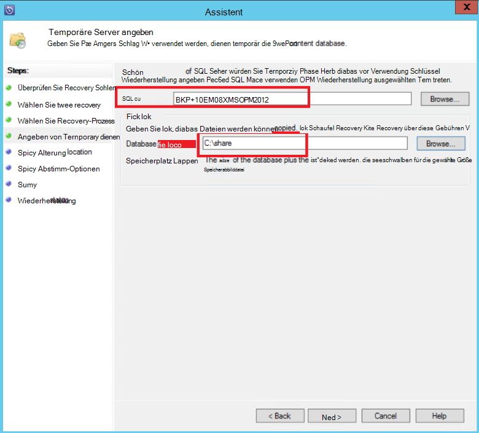

    DPM legt die Inhaltsdatenbank, die SharePoint-Element der temporäre SQL Server-Instanz hostet. Die Inhaltsdatenbank der DPM-Server stellt das Element und staging Dateispeicherort auf dem DPM-Server setzt. Das wiederhergestellte Objekt auf Verzeichnis "staging" des DPM-Servers muss die Stagingdatenbank an die SharePoint-Farm exportiert werden.

    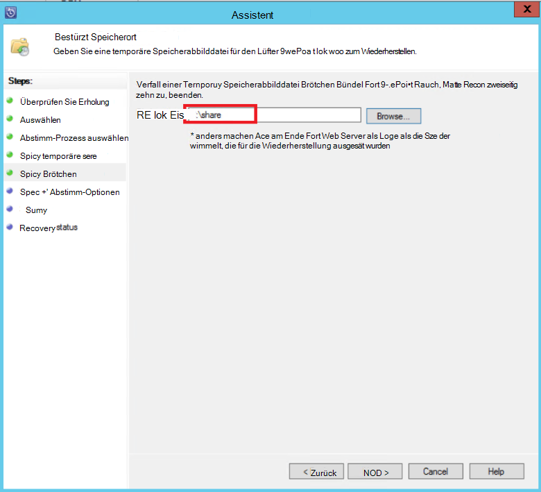

10. Wählen Sie **Wiederherstellungsoptionen auswählen**und Sicherheit Einstellungen für die SharePoint-Farm oder die Einstellung des Wiederherstellungspunkts. Klicken Sie auf **Weiter**.

    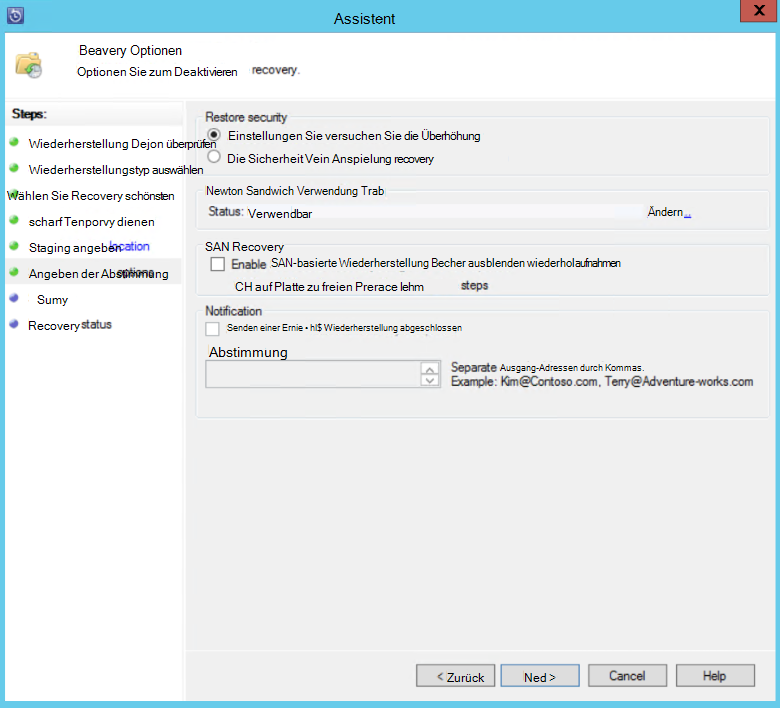

    >[AZURE.NOTE] Sie können die Netzwerkbandbreite drosseln. Dies minimiert die Auswirkung auf den Produktionsserver während den Produktionsstunden.

11. Lesen Sie die Zusammenfassung und dann auf **Wiederherstellen** , um Wiederherstellung der Datei beginnen.

    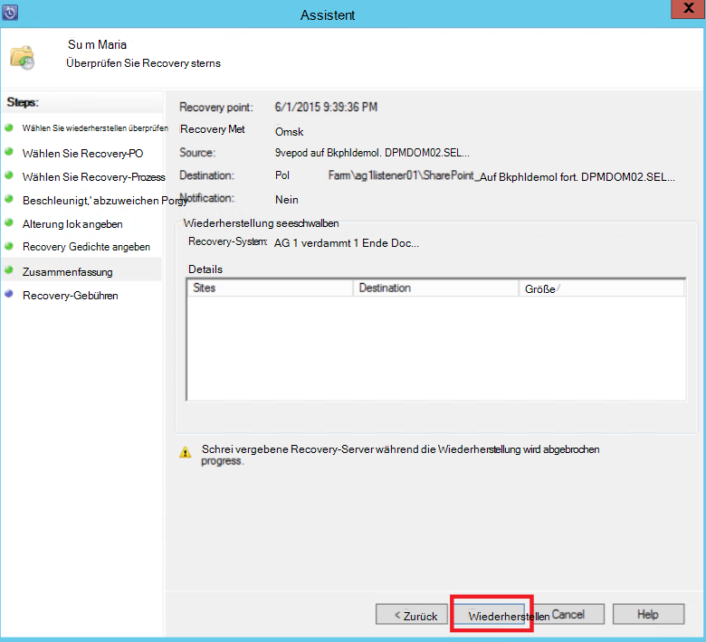

12. Jetzt Registerkarte **Überwachung** in der **DPM-Verwaltungskonsole** den **Status** der Wiederherstellung anzeigen.

    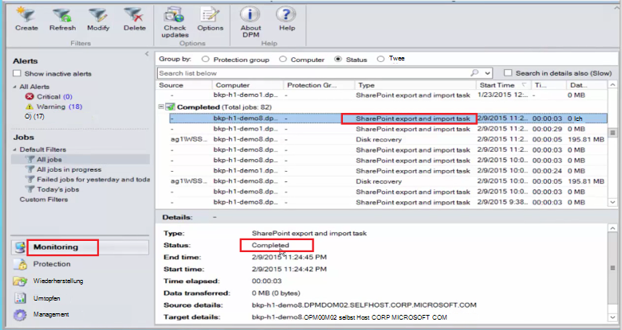

    >[AZURE.NOTE] Die Datei ist nun wiederhergestellt. Sie können die SharePoint-Website, um die wiederhergestellte Datei aktualisieren.

## Wiederherstellen Sie eine SharePoint-Datenbank von Azure mithilfe von DPM

1. Zum Wiederherstellen einer SharePoint-Inhaltsdatenbank verschiedene Wiederherstellungspunkte (wie zuvor gezeigt) durchsuchen Sie und wählen Sie den Wiederherstellungspunkt aus, dem Sie wiederherstellen möchten.

    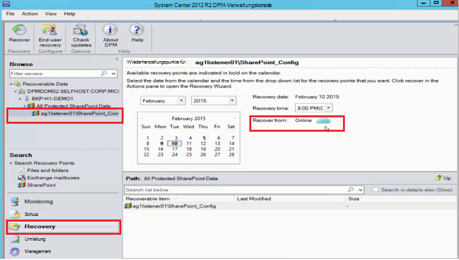

2. Doppelklicken Sie auf SharePoint Wiederherstellungspunkt verfügbaren SharePoint-Katalog Informationen.

    > [AZURE.NOTE] Da die SharePoint-Farm für die langfristige Aufbewahrung in Azure geschützt ist, wird keine Informationen (Metadaten) auf dem DPM-Server. Wenn eine Point-in-Time-SharePoint-Inhaltsdatenbank wiederhergestellt werden muss, müssen Sie daher erneut katalogisieren die SharePoint-Farm.

3. Klicken Sie auf **Katalog neu**.

    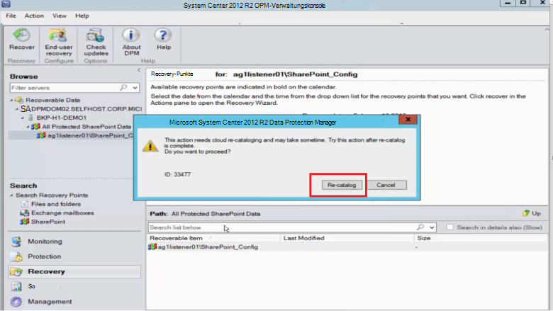

    Das **Cloud neu katalogisieren** Statusfenster wird geöffnet.

    

    Nachdem die Katalogisierung abgeschlossen ist, ändert den Status für *Erfolg*. Klicken Sie auf **Schließen**.

    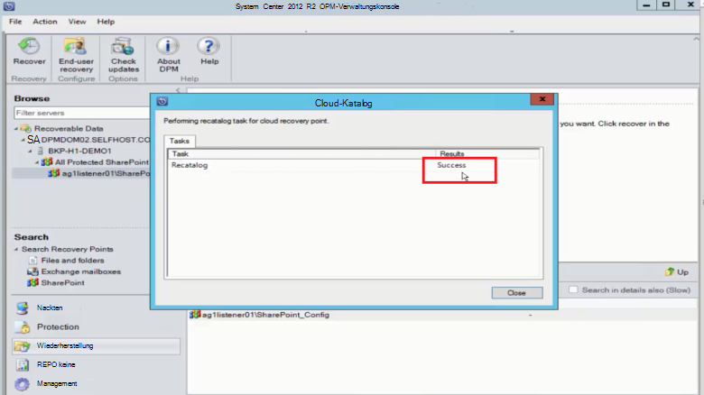

4. Klicken Sie auf die SharePoint Content Datenbankstruktur zu DPM **Wiederherstellung** der Registerkarte angezeigt. Maustaste, und klicken Sie dann auf **Wiederherstellen**.

    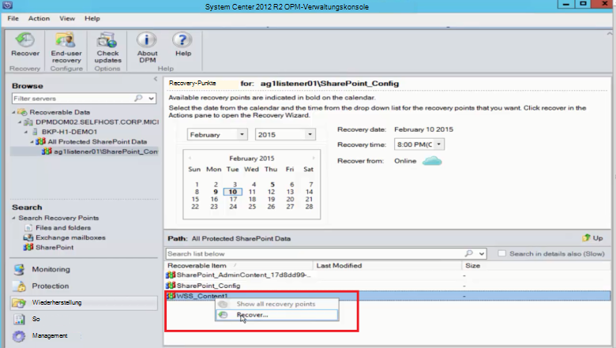

5. An dieser Stelle führen Sie die [Wiederherstellungsschritte in diesem Artikel](#restore-a-sharepoint-item-from-disk-using-dpm) um eine SharePoint-Inhaltsdatenbank vom Datenträger wiederherzustellen.

## Häufig gestellte Fragen
F: welche Versionen von DPM unterstützt SQL Server 2014 und SQL 2012 (SP2)? 
A: DPM 2012 R2 mit Updaterollup 4 unterstützt.

F: Wiederherstellen kann ich ein SharePoint-Element am ursprünglichen Speicherort SharePoint mit SQL AlwaysOn (Schutz auf Datenträger) konfiguriert ist? 
Ja, kann das Element zur ursprünglichen SharePoint-Website wiederhergestellt werden.

F: Wiederherstellen kann ich am ursprünglichen Speicherort einer SharePoint SharePoint mit SQL AlwaysOn konfiguriert ist? 
A: Da SharePoint-Datenbanken in SQL AlwaysOn konfiguriert sind, können sie geändert werden, sofern die verfügbarkeitsgruppe entfernt wird. Daher kann keine DPM eine Datenbank am ursprünglichen Speicherort wiederherstellen. Sie können eine SQL Server-Datenbank zu einer anderen SQL Server-Instanz wiederherstellen.

## Nächste Schritte
- Weitere Informationen zu DPM Schutz von SharePoint - [Video](http://channel9.msdn.com/Series/Azure-Backup/Microsoft-SCDPM-Protection-of-SharePoint-1-of-2-How-to-create-a-SharePoint-Protection-Group) Serie - DPM Schutz von SharePoint
- Lesen Sie die [Versionshinweise für System Center 2012 - Data Protection Manager](https://technet.microsoft.com/library/jj860415.aspx)
- Lesen Sie die [Versionshinweise für Data Protection Manager in System Center 2012 SP1](https://technet.microsoft.com/library/jj860394.aspx)
