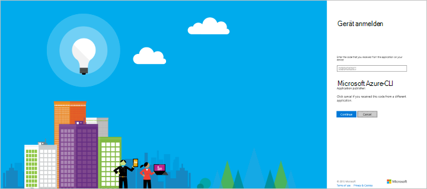
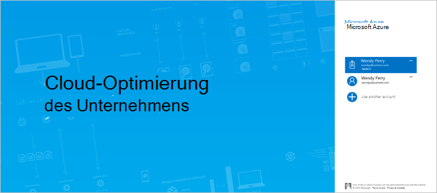
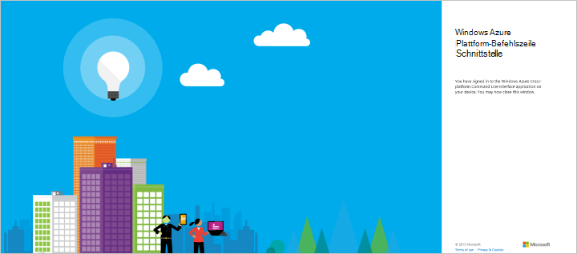

<properties
    pageTitle="DocumentDB Automatisierung – Resource Manager - CLI | Microsoft Azure"
    description="Azure-Ressourcen-Manager Vorlagen oder CLI Datenbankkonto DocumentDB bereitstellen. DocumentDB ist eine cloudbasierte NoSQL-Datenbank für JSON-Daten."
    services="documentdb"
    authors="mimig1"
    manager="jhubbard"
    editor=""
    tags="azure-resource-manager"
    documentationCenter=""/>

<tags 
    ms.service="documentdb" 
    ms.workload="data-services" 
    ms.tgt_pltfrm="na" 
    ms.devlang="na" 
    ms.topic="article" 
    ms.date="09/28/2016" 
    ms.author="mimig"/>

# Automatisieren Sie DocumentDB Erstellung Azure CLI und Azure Resource Manager Vorlagen 

> [AZURE.SELECTOR]
- [Azure-portal](documentdb-create-account.md)
- [Azure CLI und ARM](documentdb-automation-resource-manager-cli.md)

Dieser Artikel beschreibt, wie ein Azure DocumentDB-Konto mithilfe von Azure-Ressourcen-Manager Vorlagen oder direkt mit der Azure Befehlszeilenschnittstelle (CLI) erstellen. DocumentDB-Konto über das Azure-Portal finden Sie [DocumentDB Datenbankkonto mit Azure-Portal erstellen](documentdb-create-account.md).

DocumentDB Datenbankkonten sind derzeit nur DocumentDB-Ressource, die mit Ressourcen-Manager Vorlagen und Azure-CLI.

## Vorbereitung

Vor der Verwendung von Azure-CLI Azure Ressourcengruppen müssen Sie rechts Azure CLI-Version und ein Azure-Konto. Haben Sie die Azure-CLI [Installieren](../xplat-cli-install.md).

### Aktualisieren Sie Ihre Azure-CLI-version

Geben Sie an der Befehlszeile `azure --version` um festzustellen, ob Sie Version 0.10.4 installiert haben oder höher. Sie möglicherweise an Microsoft Azure CLI Datenerfassung in diesem Schritt und y oder n, anmelden oder abmelden können.

    azure --version
    0.10.4 (node: 4.2.4)

Ist die Version 0.10.4 oder höher müssen entweder [Azure CLI installieren](../xplat-cli-install.md) oder Aktualisieren mithilfe der systemeigenen Installationsprogramme oder durch **Npm** eingeben `npm update -g azure-cli` aktualisieren oder `npm install -g azure-cli` installiert.

### Legen Sie Ihre Azure-Konto und Ihr Abonnement

Wenn nicht bereits ein Azure-Abonnement ein Visual Studio-Abonnement haben, können Sie Ihre [Visual Studio-Abonnementvorteile](https://azure.microsoft.com/pricing/member-offers/msdn-benefits-details/)aktivieren. Oder Sie können eine [kostenlose Testversion](https://azure.microsoft.com/pricing/free-trial/).

Sie müssen eine Arbeit oder schulkonto Identität einer Microsoft Azure Resource Management-Vorlagen. Wenn Sie eines dieser Konten haben, geben Sie folgenden Befehl:

    azure login

Die folgende Ausgabe erzeugt: 

    info:    Executing command login
  	|info:    To sign in, use a web browser to open the page https://aka.ms/devicelogin. 
    Enter the code E1A2B3C4D to authenticate.

> [AZURE.NOTE] Wenn ein Azure-Konto haben, sehen Sie eine Fehlermeldung, dass Sie eine andere Art von Konto benötigen. Erstellen aus Ihrem aktuellen Azure-Konto finden Sie unter [Erstellen einer Arbeit oder Schule Azure Active Directory-Identität](../virtual-machines/virtual-machines-windows-create-aad-work-id.md).

Öffnen Sie [https://aka.ms/devicelogin](https://aka.ms/devicelogin) in einem Browser, und geben Sie den Code in der Ausgabe des Befehls.

Nachdem Sie den Code eingegeben haben, wählen Sie die Identität zu im Browser verwenden und geben Sie Ihren Benutzernamen und Kennwort bei Bedarf.

Die folgenden Bestätigungsbildschirm angezeigt, wenn Sie erfolgreich angemeldet und können Sie dann das Browserfenster schließen.

Die Befehlsshell ist auch der folgenden Ausgabe:

    /info:    Added subscription Visual Studio Ultimate with MSDN
    info:    Setting subscription "Visual Studio Ultimate with MSDN" as default
    +
    info:    login command OK

Neben der interaktiven Anmeldung beschriebenen sind zusätzliche Azure CLI Login Methoden verfügbar. Weitere Informationen zu anderen Methoden und Informationen über die Behandlung mehrerer Abonnements finden Sie unter [mit Azure-Abonnement aus der Azure-Befehlszeilenschnittstelle (CLI Azure)](../xplat-cli-connect.md).

### Azure-CLI Ressource Gruppe Modus wechseln

Standardmäßig wird der Azure-CLI die Service Management Modus (**Asm** ). Geben Sie folgende Ressource Modus wechseln.

    azure config mode arm

Die bietet der folgenden Ausgabe:

    info:    Executing command config mode
    info:    New mode is arm
    info:    config mode command OK

Bei Bedarf, Sie können zurück zum Standard-Befehle eingeben `azure config mode asm`.

### Erstellen Sie oder der Ressourcengruppe

Zum Erstellen eines DocumentDB-Kontos benötigen Sie zunächst eine Ressourcengruppe. Wenn Sie den Namen der Ressourcengruppe, die Sie verwenden möchten bereits kennen, fahren Sie mit [Schritt2](#create-documentdb-account-cli). 

Eine Liste aller aktuellen Ressourcengruppen, führen Sie den folgenden Befehl und den Namen der Ressource-Gruppe verwenden möchten: 

    azure group list

Eine Ressourcengruppe erstellen, führen Sie den folgenden Befehl, geben Sie den Namen des neue Ressourcengruppe erstellen und dem Bereich in der Ressourcengruppe erstellt: 

    azure group create <resourcegroupname> <resourcegrouplocation>

 - `<resourcegroupname>`können nur alphanumerische Zeichen, Punkte, Unterstriche, das '-' Zeichen und Klammern und kann nicht mit einem Punkt enden. 
 - `<resourcegrouplocation>`der Regionen muss in der DocumentDB allgemein verfügbar ist. Die aktuelle Liste der Bereiche erfolgt auf der [Seite Azure-Regionen](https://azure.microsoft.com/regions/#services).

Beispieleingabe:

    azure group create new_res_group westus

Die folgende Ausgabe erzeugt:

    info:    Executing command group create
    + Getting resource group new_res_group
    + Creating resource group new_res_group
    info:    Created resource group new_res_group
    data:    Id:                  /subscriptions/xxxxxxxx-xxxx-xxxx-xxxx-xxxxxxxxxxxx/resourceGroups/new_res_group
    data:    Name:                new_res_group
    data:    Location:            westus
    data:    Provisioning State:  Succeeded
    data:    Tags: null
    data:
    info:    group create command OK

Wenn Fehler auftreten, finden Sie unter [Problembehandlung](#troubleshooting). 

## Grundlegendes zum Ressourcen-Manager Vorlagen und Ressourcengruppen

Die meisten werden aus einer Kombination von verschiedenen Typen (z. B. DocumentDB-Konto Speicherkonten, ein virtuelles Netzwerk oder Content Delivery Networks) erstellt. Standardmäßige Azure Servicemanagement-API und Azure-Portal dargestellt mit Dienst-Ansatz dieser Elemente. Bei dieser Vorgehensweise müssen Sie bereitstellen und die einzelnen Dienste einzeln verwalten (oder andere Tools, die dazu finden) und nicht als eine logische Einheit der Bereitstellung.

*Azure-Ressourcen-Manager Vorlagen* ermöglichen bereitstellen und diese anderen Ressourcen als eine logische Bereitstellungseinheit auf deklarative Weise verwalten. Unbedingt sagen Azure, was einen Befehl nach der anderen bereitstellen, die gesamte Bereitstellung in eine JSON - alle Ressourcen und zugeordneten Parametern, die Konfiguration und Bereitstellung – beschreiben und sagen Azure Ressourcen als Gruppe bereitstellen.

Sie können viele Azure Ressourcengruppen und was sie in der [Übersicht über Azure Ressource-Manager](../azure-resource-manager/resource-group-overview.md)dafür mehr erfahren. Wenn Sie Vorlagen erstellen, finden Sie unter [Erstellen von Azure Resource Manager Vorlagen](../resource-group-authoring-templates.md).

## Aufgabe: Erstellen eines einzelnen Region DocumentDB-Konto

Verwenden Sie die Schritte in diesem Abschnitt Erstellen eines Kontos für einzelne Region DocumentDB. Dazu werden Azure-CLI mit oder ohne Ressourcen-Manager-Vorlagen verwenden.

### Erstellen Sie ein einzelnes Region DocumentDB Konto Azure CLI ohne Ressourcen-Manager Vorlagen

Erstellen eines Kontos DocumentDB in neue oder vorhandene Ressourcengruppe durch den folgenden Befehl an der Befehlszeile eingeben:

> [AZURE.TIP] Wenn dieser Befehl in Azure PowerShell oder Windows PowerShell erhalten Sie eine Fehlermeldung über ein unerwartetes Token. Führen Sie mit diesem Befehl in der Windows-Befehlszeile. 

    azure resource create -g <resourcegroupname> -n <databaseaccountname> -r "Microsoft.DocumentDB/databaseAccounts" -o 2015-04-08 -l <resourcegrouplocation> -p "{\"databaseAccountOfferType\":\"Standard\",\"locations\":["{\"locationName\":\"<databaseaccountlocation>\",\"failoverPriority\":\"<failoverPriority>\"}"]}"

 - `<resourcegroupname>`können nur alphanumerische Zeichen, Punkte, Unterstriche, das '-' Zeichen und Klammern und kann nicht mit einem Punkt enden.
 - `<resourcegrouplocation>`ist der Bereich der aktuellen Ressourcengruppe.
 - `<databaseaccountname>`können Sie nur Kleinbuchstaben, Zahlen, der '-' Zeichen und muss zwischen 3 und 50 Zeichen lang sein.
 - `<databaseaccountlocation>`der Regionen muss in der DocumentDB allgemein verfügbar ist. Die aktuelle Liste der Bereiche erfolgt auf der [Seite Azure-Regionen](https://azure.microsoft.com/regions/#services).

Beispieleingabe: 

    azure resource create -g new_res_group -n samplecliacct -r "Microsoft.DocumentDB/databaseAccounts" -o 2015-04-08 -l westus -p "{\"databaseAccountOfferType\":\"Standard\",\"locations\":["{\"locationName\":\"westus\",\"failoverPriority\":\"0\"}"]}"

Die folgende Ausgabe erzeugt, wie Ihr neue Konto bereitgestellt wird:

    info:    Executing command resource create
    + Getting resource samplecliacct
    + Creating resource samplecliacct
    info:    Resource samplecliacct is updated
    data:
    data:    Id:        /subscriptions/xxxxxxxx-xxxx-xxxx-xxxx-xxxxxxxxxxxx/resourceGroups/new_res_group/providers/Microsoft.DocumentDB/databaseAccounts/samplecliacct
    data:    Name:      samplecliacct
    data:    Type:      Microsoft.DocumentDB/databaseAccounts
    data:    Parent:
    data:    Location:  West US
    data:    Tags:
    data:
    info:    resource create command OK

Wenn Fehler auftreten, finden Sie unter [Problembehandlung](#troubleshooting). 

Nach Abschluss des Befehls wird das Konto sein **Erstellen** ein paar Minuten, bevor der **Online** -Status wird in der zur Verfügung steht. Sie können den Status des Kontos in [Azure-Portal](https://portal.azure.com)auf der **DocumentDB-Konten** überprüfen.

### Erstellen Sie ein DocumentDB für einzelne Region Konto Ressourcenmanager Vorlagen mit Azure-CLI

Die Schritte in diesem Abschnitt beschrieben mit einer Vorlage Azure-Ressourcen-Manager und eine optionale Parameter, die JSON-Dateien sind DocumentDB registrieren. Mit einer Vorlage können Sie beschreiben Sie genau, was Sie wollen und ohne Fehler wiederholen.

Erstellen Sie eine lokale Vorlagendatei mit folgendem Inhalt. Benennen Sie die Datei azuredeploy.json.

    {
        "$schema": "http://schema.management.azure.com/schemas/2015-01-01/deploymentTemplate.json#",
        "contentVersion": "1.0.0.0",
        "parameters": {
            "databaseAccountName": {
                "type": "string"
            },
            "locationName1": {
                "type": "string"
            }
        },
        "variables": {},
        "resources": [
            {
                "apiVersion": "2015-04-08",
                "type": "Microsoft.DocumentDb/databaseAccounts",
                "name": "[parameters('databaseAccountName')]",
                "location": "[resourceGroup().location]",
                "properties": {
                    "databaseAccountOfferType": "Standard",
                    "locations": [
                        {
                            "failoverPriority": 0,
                            "locationName": "[parameters('locationName1')]"
                        }
                    ]
                }
            }
        ]
    }

Die FailoverPriority muss auf 0 festgelegt werden, da dies eine einzige Region Konto. Ein FailoverPriority von 0 gibt an, dass diese Region als [Bereich für das Konto DocumentDB schreiben]beibehalten werden[scaling-globally]. Sie können die Eingabe in der Befehlszeile oder erstellen eine Parameterdatei, um den Wert anzugeben.

Um eine Datei zu erstellen, kopieren Sie den folgenden Inhalt in eine neue Datei, und nennen Sie die Datei azuredeploy.parameters.json. Wenn Sie den Datenbank-Kontonamen in der Befehlszeile angeben möchten, können Sie fortfahren, ohne diese Datei zu erstellen.

    {
        "$schema": "http://schema.management.azure.com/schemas/2015-01-01/deploymentParameters.json#",
        "contentVersion": "1.0.0.0",
        "parameters": {
            "databaseAccountName": {
                "value": "samplearmacct"
            },
            "locationName1": {
                "value": "westus"
            }
        }
    }

Aktualisieren Sie in der Datei azuredeploy.parameters.json im Wertefeld der `"samplearmacct"` dem Datenbanknamen verwenden möchten, speichern Sie die Datei. `"databaseAccountName"`können Sie nur Kleinbuchstaben, Zahlen, der '-' Zeichen und muss zwischen 3 und 50 Zeichen lang sein. Aktualisieren Sie im Wertefeld der `"locationName1"` in den Bereich, wo Sie das DocumentDB-Konto erstellen möchten.

Um ein DocumentDB Konto in der Ressourcengruppe zu erstellen, führen Sie den folgenden Befehl und geben Sie den Pfad zu der Vorlagendatei den Pfad zu der Datei oder Parameterwert, den Namen der Ressourcengruppe, bereitstellen und ein Deployment (-n ist optional). 

So verwenden Sie eine Datei

    azure group deployment create -f <PathToTemplate> -e <PathToParameterFile> -g <resourcegroupname> -n <deploymentname>

 - `<PathToTemplate>`ist der Pfad der in Schritt 1 erstellte azuredeploy.json-Datei. Wenn der Pfadname Leerzeichen enthält, setzen Sie dieser Parameter in Anführungszeichen.
 - `<PathToParameterFile>`ist der Pfad der in Schritt 1 erstellte azuredeploy.parameters.json-Datei. Wenn der Pfadname Leerzeichen enthält, setzen Sie dieser Parameter in Anführungszeichen.
 - `<resourcegroupname>`ist der Name der Ressourcengruppe, ein DocumentDB Konto hinzufügen. 
 - `<deploymentname>`ist der optionale Name der Bereitstellung.

Beispieleingabe: 

    azure group deployment create -f azuredeploy.json -e azuredeploy.parameters.json -g new_res_group -n azuredeploy

ODER geben den Parameter für Konto den Namen ohne eine Datei stattdessen erhalten aufgefordert, den Wert und den folgenden Befehl ausführen:

    azure group deployment create -f <PathToTemplate> -g <resourcegroupname> -n <deploymentname>

Beispieleingabe die Aufforderung und Eintrag für ein Konto mit dem Namen Samplearmacct:

    azure group deployment create -f azuredeploy.json -g new_res_group -n azuredeploy
    info:    Executing command group deployment create
    info:    Supply values for the following parameters
    databaseAccountName: samplearmacct

Wie das Konto eingerichtet ist, erhalten Sie folgende Informationen: 

    info:    Executing command group deployment create
    + Initializing template configurations and parameters
    + Creating a deployment
    info:    Created template deployment "azuredeploy"
    + Waiting for deployment to complete
    + 
    + 
    info:    Resource 'new_res_group' of type 'Microsoft.DocumentDb/databaseAccounts' provisioning status is Running
    + 
    info:    Resource 'new_res_group' of type 'Microsoft.DocumentDb/databaseAccounts' provisioning status is Succeeded
    data:    DeploymentName     : azuredeploy
    data:    ResourceGroupName  : new_res_group
    data:    ProvisioningState  : Succeeded
    data:    Timestamp          : 2015-11-30T18:50:23.6300288Z
    data:    Mode               : Incremental
    data:    CorrelationId      : 4a5d4049-c494-4053-bad4-cc804d454700
    data:    DeploymentParameters :
    data:    Name                 Type    Value
    data:    -------------------  ------  ------------------
    data:    databaseAccountName  String  samplearmacct
    data:    locationName1        String  westus
    info:    group deployment create command OK

Wenn Fehler auftreten, finden Sie unter [Problembehandlung](#troubleshooting).  

Nach Abschluss des Befehls wird das Konto sein **Erstellen** ein paar Minuten, bevor der **Online** -Status wird in der zur Verfügung steht. Sie können den Status des Kontos in [Azure-Portal](https://portal.azure.com)auf der **DocumentDB-Konten** überprüfen.

## Aufgabe: Erstellen Sie ein Konto mit mehreren DocumentDB

DocumentDB kann [Ihre Daten weltweit verteilt] [ distribute-globally] in verschiedenen [Azure-Regionen](https://azure.microsoft.com/regions/#services). Beim Erstellen einer DocumentDB-Kontos können der Bereiche in denen Dienst vorhanden sein sollen angegeben werden. Verwenden der Anleitung in diesem Abschnitt erstellen Sie ein Konto mit mehreren DocumentDB. Dazu werden Azure-CLI mit oder ohne Ressourcen-Manager-Vorlagen verwenden.

### Erstellen Sie ein mit mehreren DocumentDB Konto mit Azure CLI ohne Ressourcen-Manager Vorlagen

Erstellen eines Kontos DocumentDB in neue oder vorhandene Ressourcengruppe durch den folgenden Befehl an der Befehlszeile eingeben:

> [AZURE.TIP] Wenn dieser Befehl in Azure PowerShell oder Windows PowerShell erhalten Sie eine Fehlermeldung über ein unerwartetes Token. Führen Sie mit diesem Befehl in der Windows-Befehlszeile. 

    azure resource create -g <resourcegroupname> -n <databaseaccountname> -r "Microsoft.DocumentDB/databaseAccounts" -o 2015-04-08 -l <resourcegrouplocation> -p "{\"databaseAccountOfferType\":\"Standard\",\"locations\":["{\"locationName\":\"<databaseaccountlocation1>\",\"failoverPriority\":\"<failoverPriority1>\"},{\"locationName\":\"<databaseaccountlocation2>\",\"failoverPriority\":\"<failoverPriority2>\"}"]}"

 - `<resourcegroupname>`können nur alphanumerische Zeichen, Punkte, Unterstriche, das '-' Zeichen und Klammern und kann nicht mit einem Punkt enden.
 - `<resourcegrouplocation>`ist der Bereich der aktuellen Ressourcengruppe.
 - `<databaseaccountname>`können Sie nur Kleinbuchstaben, Zahlen, der '-' Zeichen und muss zwischen 3 und 50 Zeichen lang sein.
 - `<databaseaccountlocation1>`und `<databaseaccountlocation2>` muß Regionen, in denen DocumentDB erhältlich. Die aktuelle Liste der Bereiche erfolgt auf der [Seite Azure-Regionen](https://azure.microsoft.com/regions/#services).

Beispieleingabe: 

    azure resource create -g new_res_group -n samplecliacct -r "Microsoft.DocumentDB/databaseAccounts" -o 2015-04-08 -l westus -p "{\"databaseAccountOfferType\":\"Standard\",\"locations\":["{\"locationName\":\"westus\",\"failoverPriority\":\"0\"},{\"locationName\":\"eastus\",\"failoverPriority\":\"1\"}"]}"

Die folgende Ausgabe erzeugt, wie Ihr neue Konto bereitgestellt wird:

    info:    Executing command resource create
    + Getting resource samplecliacct
    + Creating resource samplecliacct
    info:    Resource samplecliacct is updated
    data:
    data:    Id:        /subscriptions/xxxxxxxx-xxxx-xxxx-xxxx-xxxxxxxxxxxx/resourceGroups/new_res_group/providers/Microsoft.DocumentDB/databaseAccounts/samplecliacct
    data:    Name:      samplecliacct
    data:    Type:      Microsoft.DocumentDB/databaseAccounts
    data:    Parent:
    data:    Location:  West US
    data:    Tags:
    data:
    info:    resource create command OK

Wenn Fehler auftreten, finden Sie unter [Problembehandlung](#troubleshooting). 

Nach Abschluss des Befehls wird das Konto sein **Erstellen** ein paar Minuten, bevor der **Online** -Status wird in der zur Verfügung steht. Sie können den Status des Kontos in [Azure-Portal](https://portal.azure.com)auf der **DocumentDB-Konten** überprüfen.

### Registrieren Sie mit mehreren DocumentDB Ressourcenmanager Vorlagen mit Azure-CLI

Die Schritte in diesem Abschnitt beschrieben mit einer Vorlage Azure-Ressourcen-Manager und eine optionale Parameter, die JSON-Dateien sind DocumentDB registrieren. Mit einer Vorlage können Sie beschreiben Sie genau, was Sie wollen und ohne Fehler wiederholen.

Erstellen Sie eine lokale Vorlagendatei mit folgendem Inhalt. Benennen Sie die Datei azuredeploy.json.

    {
        "$schema": "http://schema.management.azure.com/schemas/2015-01-01/deploymentTemplate.json#",
        "contentVersion": "1.0.0.0",
        "parameters": {
            "databaseAccountName": {
                "type": "string"
            },
            "locationName1": {
                "type": "string"
            },
            "locationName2": {
                "type": "string"
            }
        },
        "variables": {},
        "resources": [
            {
                "apiVersion": "2015-04-08",
                "type": "Microsoft.DocumentDb/databaseAccounts",
                "name": "[parameters('databaseAccountName')]",
                "location": "[resourceGroup().location]",
                "properties": {
                    "databaseAccountOfferType": "Standard",
                    "locations": [
                        {
                            "failoverPriority": 0,
                            "locationName": "[parameters('locationName1')]"
                        },
                        {
                            "failoverPriority": 1,
                            "locationName": "[parameters('locationName2')]"
                        }
                    ]
                }
            }
        ]
    }

Die vorangehenden Vorlagendatei kann verwendet werden, ein DocumentDB-Konto mit zwei Bereichen erstellen. Erstellen Sie das Konto mit mehr, "Lagerorte" Array hinzufügen und die entsprechenden Parameter hinzufügen.

Eines der FailoverPriority der Wert 0 an, diesen Bereich so [Schreiben Region für DocumentDB-Konto]muss[scaling-globally]. Prioritätswerte Failover muss zwischen den Standorten und der höchste Prioritätswert Failover muss kleiner sein als die Gesamtzahl der Bereiche. Sie können die Eingabe in der Befehlszeile oder erstellen eine Parameterdatei, um den Wert anzugeben.

Um eine Datei zu erstellen, kopieren Sie den folgenden Inhalt in eine neue Datei, und nennen Sie die Datei azuredeploy.parameters.json. Wenn Sie den Datenbank-Kontonamen in der Befehlszeile angeben möchten, können Sie fortfahren, ohne diese Datei zu erstellen.

    {
        "$schema": "http://schema.management.azure.com/schemas/2015-01-01/deploymentParameters.json#",
        "contentVersion": "1.0.0.0",
        "parameters": {
            "databaseAccountName": {
                "value": "samplearmacct"
            },
            "locationName1": {
                "value": "westus"
            },
            "locationName2": {
                "value": "eastus"
            }
        }
    }

Aktualisieren Sie in der Datei azuredeploy.parameters.json im Wertefeld der `"samplearmacct"` dem Datenbanknamen verwenden möchten, speichern Sie die Datei. `"databaseAccountName"`können Sie nur Kleinbuchstaben, Zahlen, der '-' Zeichen und muss zwischen 3 und 50 Zeichen lang sein. Aktualisieren Sie im Wertefeld der `"locationName1"` und `"locationName2"` in den Bereich, wo Sie das DocumentDB-Konto erstellen möchten.

Um ein DocumentDB Konto in der Ressourcengruppe zu erstellen, führen Sie den folgenden Befehl und geben Sie den Pfad zu der Vorlagendatei den Pfad zu der Datei oder Parameterwert, den Namen der Ressourcengruppe, bereitstellen und ein Deployment (-n ist optional). 

So verwenden Sie eine Datei

    azure group deployment create -f <PathToTemplate> -e <PathToParameterFile> -g <resourcegroupname> -n <deploymentname>

 - `<PathToTemplate>`ist der Pfad der in Schritt 1 erstellte azuredeploy.json-Datei. Wenn der Pfadname Leerzeichen enthält, setzen Sie dieser Parameter in Anführungszeichen.
 - `<PathToParameterFile>`ist der Pfad der in Schritt 1 erstellte azuredeploy.parameters.json-Datei. Wenn der Pfadname Leerzeichen enthält, setzen Sie dieser Parameter in Anführungszeichen.
 - `<resourcegroupname>`ist der Name der Ressourcengruppe, ein DocumentDB Konto hinzufügen. 
 - `<deploymentname>`ist der optionale Name der Bereitstellung.

Beispieleingabe: 

    azure group deployment create -f azuredeploy.json -e azuredeploy.parameters.json -g new_res_group -n azuredeploy

ODER geben den Parameter für Konto den Namen ohne eine Datei stattdessen erhalten aufgefordert, den Wert und den folgenden Befehl ausführen:

    azure group deployment create -f <PathToTemplate> -g <resourcegroupname> -n <deploymentname>

Beispieleingabe die Aufforderung und Eintrag für ein Konto mit dem Namen Samplearmacct:

    azure group deployment create -f azuredeploy.json -g new_res_group -n azuredeploy
    info:    Executing command group deployment create
    info:    Supply values for the following parameters
    databaseAccountName: samplearmacct

Wie das Konto eingerichtet ist, erhalten Sie folgende Informationen: 

    info:    Executing command group deployment create
    + Initializing template configurations and parameters
    + Creating a deployment
    info:    Created template deployment "azuredeploy"
    + Waiting for deployment to complete
    + 
    + 
    info:    Resource 'new_res_group' of type 'Microsoft.DocumentDb/databaseAccounts' provisioning status is Running
    + 
    info:    Resource 'new_res_group' of type 'Microsoft.DocumentDb/databaseAccounts' provisioning status is Succeeded
    data:    DeploymentName     : azuredeploy
    data:    ResourceGroupName  : new_res_group
    data:    ProvisioningState  : Succeeded
    data:    Timestamp          : 2015-11-30T18:50:23.6300288Z
    data:    Mode               : Incremental
    data:    CorrelationId      : 4a5d4049-c494-4053-bad4-cc804d454700
    data:    DeploymentParameters :
    data:    Name                 Type    Value
    data:    -------------------  ------  ------------------
    data:    databaseAccountName  String  samplearmacct
    data:    locationName1        String  westus
    data:    locationName2        String  eastus
    info:    group deployment create command OK

Wenn Fehler auftreten, finden Sie unter [Problembehandlung](#troubleshooting).  

Nach Abschluss des Befehls wird das Konto sein **Erstellen** ein paar Minuten, bevor der **Online** -Status wird in der zur Verfügung steht. Sie können den Status des Kontos in [Azure-Portal](https://portal.azure.com)auf der **DocumentDB-Konten** überprüfen.

## Problembehandlung

Wenn Sie wie Fehlermeldungen `Deployment provisioning state was not successful` beim Erstellen der Ressource oder Kontos haben Sie einige Optionen. 

> [AZURE.NOTE] Ungültige Zeichen im Kontonamen Datenbank bereitstellen oder einen Standort in der DocumentDB nicht verfügbar ist führen Bereitstellungsfehlern. Datenbank-Konto Namen können nur Kleinbuchstaben, Zahlen der '-' Zeichen und muss zwischen 3 und 50 Zeichen lang sein. Alle gültigen Konto Datenbankpfade werden auf der [Seite Azure Regionen](https://azure.microsoft.com/regions/#services)aufgelistet.

- Die Ausgabe enthält die folgenden `Error information has been recorded to C:\Users\wendy\.azure\azure.err`, überprüfen Sie die Fehlerinformationen in der Datei azure.err.

- Sie finden nützlichen Informationen in der Protokolldatei für die Ressourcengruppe. Um die Protokolldatei anzuzeigen, führen Sie den folgenden Befehl ein:

        azure group log show <resourcegroupname> --last-deployment

    Beispieleingabe:

        azure group log show new_res_group --last-deployment

    Dann finden Sie [Problembehandlung Ressource Gruppe Bereitstellung in Azure](../resource-manager-troubleshoot-deployments-cli.md) Weitere Informationen.

- Fehlerinformationen sind auch in Azure-Portal verfügbar, wie im folgenden Screenshot gezeigt. Navigieren zu der Fehlerinformationen: auf Gruppen der Indexleiste, wählen Sie die Ressourcengruppe, die Fehler im Bereich der Ressource Blatt klicken Sie auf das Datum der letzten Essentials und Bereitstellung Geschichte Blatt fehlgeschlagenen Weitergabe klicken Sie in der Bereitstellung Blade ins Vorgang mit roten Ausrufezeichen. Statusnachricht für den fehlgeschlagenen Weitergabe wird im Blatt Details Vorgang angezeigt. 

     

## Nächste Schritte

Jetzt haben Sie ein DocumentDB-Konto, besteht der nächste Schritt zum Erstellen einer Datenbank DocumentDB. Sie können eine Datenbank erstellen, mithilfe einer der folgenden:

- Azure-Portal gemäß [einer DocumentDB über das Azure-Portal erstellen](documentdb-create-database.md).
- Im [Datenbank-Management](https://github.com/Azure/azure-documentdb-net/tree/master/samples/code-samples/DatabaseManagement) -Projekt auf GitHub Repository [Azure Documentdb Dotnet](https://github.com/Azure/azure-documentdb-net/tree/master/samples/code-samples) .NET C#-Beispiele.
- Die [DocumentDB-SDKs](https://msdn.microsoft.com/library/azure/dn781482.aspx). DocumentDB wurde .NET Java, Python, Node.js und JavaScript API-SDKs. 

Nach dem Erstellen der Datenbank müssen Sie der Datenbank [Hinzufügen, Dokumente](documentdb-view-json-document-explorer.md) Sammlungen [Hinzufügen einer oder mehrerer Sammlungen](documentdb-create-collection.md) . 

Wenn Sie Dokumente in einer Auflistung haben, können [DocumentDB SQL](documentdb-sql-query.md) zum [Ausführen von Abfragen](documentdb-sql-query.md#executing-queries) für Dokumente Sie mit dem [Abfrage-Explorer](documentdb-query-collections-query-explorer.md) in das Portal, die [REST-API](https://msdn.microsoft.com/library/azure/dn781481.aspx)oder eines [SDKs](https://msdn.microsoft.com/library/azure/dn781482.aspx).

Erkunden Sie erfahren Sie mehr über DocumentDB:

-   [Lernpfad für DocumentDB](https://azure.microsoft.com/documentation/learning-paths/documentdb/)
-   [DocumentDB-Ressourcenmodell und Konzepte](documentdb-resources.md)

Weitere Vorlagen, die Sie verwenden können, finden Sie in [Azure Schnellstart-Vorlagen](https://azure.microsoft.com/documentation/templates/).

<!--Reference style links - using these makes the source content way more readable than using inline links-->
[distribute-globally]: https://azure.microsoft.com/en-us/documentation/articles/documentdb-distribute-data-globally
[scaling-globally]: https://azure.microsoft.com/en-us/documentation/articles/documentdb-distribute-data-globally/#scaling-across-the-planet