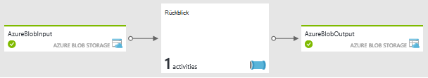
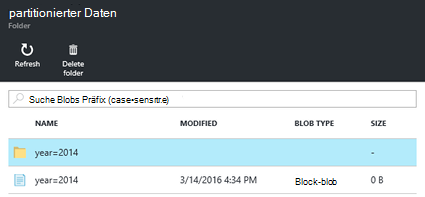
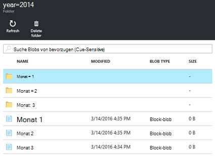

<properties
   pageTitle="Erstellen Sie bei Bedarf Hadoop Linux-basierten Clustern in Azure Data Factory mit HDInsight | Microsoft Azure"
    description="Dazu erstellen Sie bei Bedarf HDInsight Cluster mithilfe von Azure Data Factory."
   services="hdinsight"
   documentationCenter=""
   tags="azure-portal"
   authors="mumian"
   manager="jhubbard"
   editor="cgronlun"/>

<tags
   ms.service="hdinsight"
   ms.devlang="na"
   ms.topic="article"
   ms.tgt_pltfrm="na"
   ms.workload="big-data"
   ms.date="10/06/2016"
   ms.author="jgao"/>

# Erstellen Sie bei Bedarf Hadoop Linux-basierten Clustern in Azure Data Factory mit HDInsight

[AZURE.INCLUDE [selector](../../includes/hdinsight-selector-create-clusters.md)]

[Azure Data Factory](../data-factory/data-factory-introduction.md) ist ein Cloud-basierte Integrationsdienst, der koordiniert und automatisiert die Verlagerung und Transformation von Daten. In diesem Artikel erfahren Sie wie Azure Data Factory ein [Azure HDInsight auf Anforderung verknüpften Serviceartikel](../data-factory/data-factory-compute-linked-services.md#azure-hdinsight-on-demand-linked-service)erstellen und Cluster verwenden, um eine Struktur auszuführen. Hier ist der allgemeine Ablauf:

1. Erstellen Sie HDInsight Cluster auf Anforderung.
2. Führen Sie die Struktur des unformatierten Daten von einer BLOB-Speicherkonto lesen, transformiert die Daten und das Schreiben der Ausgabe ein Zielkonto BLOB-Speicher. 
3. Basierend auf der Einstellung TTL Cluster löschen

Die Hive-Aktivität definiert Data Factory Pipeline Aufrufe vordefinierten HiveQL-Skript. Das Skript erstellt eine externe Tabelle, die unformatierte Webprotokolldaten in Azure BLOB-Speicher gespeichert verweist, und teilt Rohdaten nach Jahr und Monat.

Hier sind die Beispielzeilen für jeden Monat in der Eingabedatei.

    2014-01-01,02:01:09,SAMPLEWEBSITE,GET,/blogposts/mvc4/step2.png,X-ARR-LOG-ID=2ec4b8ad-3cf0-4442-93ab-837317ece6a1,80,-,1.54.23.196,Mozilla/5.0+(Windows+NT+6.3;+WOW64)+AppleWebKit/537.36+(KHTML,+like+Gecko)+Chrome/31.0.1650.63+Safari/537.36,-,http://weblogs.asp.net/sample/archive/2007/12/09/asp-net-mvc-framework-part-4-handling-form-edit-and-post-scenarios.aspx,\N,200,0,0,53175,871 
    2014-02-01,02:01:10,SAMPLEWEBSITE,GET,/blogposts/mvc4/step7.png,X-ARR-LOG-ID=d7472a26-431a-4a4d-99eb-c7b4fda2cf4c,80,-,1.54.23.196,Mozilla/5.0+(Windows+NT+6.3;+WOW64)+AppleWebKit/537.36+(KHTML,+like+Gecko)+Chrome/31.0.1650.63+Safari/537.36,-,http://weblogs.asp.net/sample/archive/2007/12/09/asp-net-mvc-framework-part-4-handling-form-edit-and-post-scenarios.aspx,\N,200,0,0,30184,871
    2014-03-01,02:01:10,SAMPLEWEBSITE,GET,/blogposts/mvc4/step7.png,X-ARR-LOG-ID=d7472a26-431a-4a4d-99eb-c7b4fda2cf4c,80,-,1.54.23.196,Mozilla/5.0+(Windows+NT+6.3;+WOW64)+AppleWebKit/537.36+(KHTML,+like+Gecko)+Chrome/31.0.1650.63+Safari/537.36,-,http://weblogs.asp.net/sample/archive/2007/12/09/asp-net-mvc-framework-part-4-handling-form-edit-and-post-scenarios.aspx,\N,200,0,0,30184,871

Das Skript erstellt drei Ausgabeordner basierend auf vorherigen Eingaben. Jeder Ordner enthält eine Datei für die Posten pro Monat.

    adfgetstarted/partitioneddata/year=2014/month=1/000000_0
    adfgetstarted/partitioneddata/year=2014/month=2/000000_0
    adfgetstarted/partitioneddata/year=2014/month=3/000000_0

Eine Liste von Data Factory Data Transformationsaktivitäten neben Struktur finden Sie unter [Transformieren und Analysieren von Azure Data Factory verwenden](../data-factory/data-factory-data-transformation-activities.md).

Es gibt viele Vorteile bei der Verwendung von HDInsight mit Daten:

- HDInsight Cluster Abrechnung wird anteilig pro Minute, ob Sie sie oder nicht. Mit Data Factory werden Cluster bei Bedarf erstellt. Und die Cluster werden automatisch gelöscht, wenn die Aufträge abgeschlossen sind.  Sie Zahlen also nur für den Auftrag und kurze im Leerlauf (Time-to-live).
- Sie können einen Workflow Data Factory-Pipeline erstellen.
- Sie können rekursive Aufträge planen.  

> [AZURE.NOTE] Derzeit können Sie nur Linux-basierten HDInsight Clusterversion 3.2 von Azure Data Factory erstellen.

##Komponenten:

Vor diesem Artikel benötigen Sie Folgendes:

- [Azure-Abonnement](https://azure.microsoft.com/documentation/videos/get-azure-free-trial-for-testing-hadoop-in-hdinsight/).
- Azure CLI oder Azure PowerShell. 

    [AZURE.INCLUDE [use-latest-version](../../includes/hdinsight-use-latest-powershell-and-cli.md)]

##Speicherkonto vorbereiten

Sie können bis zu drei Speicherkonten in diesem Szenario:

- Standardkonto für den Cluster HDInsight Speicher
- Speicherkonto für die Eingabedaten
- Speicherkonto für die Ausgabedaten

Um das Lernprogramm zu vereinfachen, verwenden Sie ein Speicherkonto drei Zwecken dienen. Azure-CLI und Azure PowerShell-Beispielskript finden in diesem Abschnitt führen die folgenden Aufgaben:

1. Melden Sie sich bei Azure.
2. Erstellen Sie eine Azure-Ressourcengruppe.
3. Registrieren Sie Azure-Speicher.
4. Einen BLOB-Container auf das Speicherkonto erstellen
5. Kopieren Sie die folgenden zwei Dateien in den BLOB-Container:

    - Eingabedatendatei: [https://hditutorialdata.blob.core.windows.net/adfhiveactivity/inputdata/input.log](https://hditutorialdata.blob.core.windows.net/adfhiveactivity/inputdata/input.log)
    - HiveQL Skript: [https://hditutorialdata.blob.core.windows.net/adfhiveactivity/script/partitionweblogs.hql](https://hditutorialdata.blob.core.windows.net/adfhiveactivity/script/partitionweblogs.hql)

    Beide Dateien werden in einem öffentlichen BLOB-Container gespeichert. 

>[AZURE.IMPORTANT] Schreiben der Gruppe Ressourcenname, Speicher-Kontonamen und Konto Speicherschlüssel im Skript verwendet.  Sie benötigen sie im nächsten Abschnitt.

**Vorbereiten des Speichers und Dateien mit Azure-CLI**

    azure login
    
    azure config mode arm

    azure group create --name "<Azure Resource Group Name>" --location "East US 2"

    azure storage account create --resource-group "<Azure Resource Group Name>" --location "East US 2" --type "LRS" <Azure Storage Account Name>

    azure storage account keys list --resource-group "<Azure Resource Group Name>" "<Azure Storage Account Name>"
    azure storage container create "adfgetstarted" --account-name "<Azure Storage AccountName>" --account-key "<Azure Storage Account Key>"

    azure storage blob copy start "https://hditutorialdata.blob.core.windows.net/adfhiveactivity/inputdata/input.log" --dest-account-name "<Azure Storage Account Name>" --dest-account-key "<Azure Storage Account Key>" --dest-container "adfgetstarted" 
    azure storage blob copy start "https://hditutorialdata.blob.core.windows.net/adfhiveactivity/script/partitionweblogs.hql" --dest-account-name "<Azure Storage Account Name>" --dest-account-key "<Azure Storage Account Key>" --dest-container "adfgetstarted" 

Der Name ist *Adfgetstarted*.  Alles ist. Andernfalls müssen Sie die Ressourcenmanagement-Vorlage aktualisieren.

Benötigen Sie Hilfe mit diesem Skript CLI finden Sie unter [Verwendung der Azure-CLI mit Azure-Speicher](../storage/storage-azure-cli.md).

**Vorbereiten der Speichers und Dateien mithilfe von Azure PowerShell**

    $resourceGroupName = "<Azure Resource Group Name>"
    $storageAccountName = "<Azure Storage Account Name>"
    $location = "East US 2"

    $sourceStorageAccountName = "hditutorialdata"  
    $sourceContainerName = "adfhiveactivity"

    $destStorageAccountName = $storageAccountName
    $destContainerName = "adfgetstarted" # don't change this value.

    ####################################
    # Connect to Azure
    ####################################
    #region - Connect to Azure subscription
    Write-Host "`nConnecting to your Azure subscription ..." -ForegroundColor Green
    try{Get-AzureRmContext}
    catch{Login-AzureRmAccount}
    #endregion

    ####################################
    # Create a resource group, storage, and container
    ####################################

    #region - create Azure resources
    Write-Host "`nCreating resource group, storage account and blob container ..." -ForegroundColor Green

    New-AzureRmResourceGroup -Name $resourceGroupName -Location $location 
    New-AzureRmStorageAccount `
        -ResourceGroupName $resourceGroupName `
        -Name $destStorageAccountName `
        -type Standard_LRS `
        -Location $location 

    $destStorageAccountKey = (Get-AzureRmStorageAccountKey `
        -ResourceGroupName $resourceGroupName `
        -Name $destStorageAccountName)[0].Value

    $sourceContext = New-AzureStorageContext `
        -StorageAccountName $sourceStorageAccountName `
        -Anonymous
    $destContext = New-AzureStorageContext `
        -StorageAccountName $destStorageAccountName `
        -StorageAccountKey $destStorageAccountKey

    New-AzureStorageContainer -Name $destContainerName -Context $destContext
    #endregion

    ####################################
    # Copy files
    ####################################
    #region - copy files
    Write-Host "`nCopying files ..." -ForegroundColor Green

    $blobs = Get-AzureStorageBlob `
        -Context $sourceContext `
        -Container $sourceContainerName 

    $blobs|Start-AzureStorageBlobCopy `
        -DestContext $destContext `
        -DestContainer $destContainerName

    Write-Host "`nCopied files ..." -ForegroundColor Green
    Get-AzureStorageBlob -Context $destContext -Container $destContainerName 
    #endregion

    Write-host "`nYou will use the following values:" -ForegroundColor Green
    write-host "`nResource group name: $resourceGroupName"
    Write-host "Storage Account Name: $destStorageAccountName"
    write-host "Storage Account Key: $destStorageAccountKey"

    Write-host "`nScript completed" -ForegroundColor Green

Benötigen Sie Hilfe mit diesem PowerShell-Skript finden Sie unter [Verwenden von Azure PowerShell mit Azure-Speicher](../storage/storage-powershell-guide-full.md).

**Das Speicherkonto und den Inhalt**

1. Melden Sie sich auf der [Azure-Portal](https://portal.azure.com).
2. Klicken Sie im linken Bereich auf **Ressourcengruppen** .
3. Doppelklicken Sie auf die Gruppe Ressourcennamen im CLI oder PowerShell-Skript erstellten. Verwenden Sie Filter, haben viele Ressourcengruppen aufgeführt. 
4. Auf der Kachel **Ressourcen** haben Sie eine Ressource, wenn die Ressourcengruppe für andere Projekte freigeben. Die Ressource ist das Speicherkonto mit dem oben angegebenen Namen. Klicken Sie auf den speicherkontonamen.
5. Klicken Sie auf die **Blobs** Kacheln.
6. Klicken Sie auf den Container **Adfgetstarted** . Sie sehen zwei Ordner: **Daten** und **Skript**.
7. Öffnen Sie den Ordner und die Dateien in den Ordnern.
 
## Data Factory erstellen

Das Speicherkonto Eingabedaten und das HiveQL-Skript erstellt können Sie eine Azure Data Factory erstellt. Es gibt mehrere Methoden zum Erstellen von Daten-Factory. Aufrufen eine benutzerdefinierte Vorlage Ressourcenmanagement in diesem Lernprogramm verwenden Sie Azure-Portal. Sie können auch Ressourcenmanagement-Vorlage von [Azure CLI](../resource-group-template-deploy.md#deploy-with-azure-cli-for-mac-linux-and-windows) und [Azure PowerShell](../resource-group-template-deploy.md#deploy-with-powershell)aufrufen. Factorymethoden Erstellung anderer Daten finden Sie unter [Tutorial: Erstellen Sie Ihre erste Data Factory](../data-factory/data-factory-build-your-first-pipeline.md).

Auf der obersten Ebene Ressourcenmanagement-Vorlage enthält:

    {
        "contentVersion": "1.0.0.0",
        "$schema": "http://schema.management.azure.com/schemas/2015-01-01/deploymentTemplate.json#",
        "parameters": { ...
        },
        "variables": { ...
        },
        "resources": [
            {
                "name": "[parameters('dataFactoryName')]",
                "apiVersion": "[variables('apiVersion')]",
                "type": "Microsoft.DataFactory/datafactories",
                "location": "westus",
                "resources": [
                    { ... },
                    { ... },
                    { ... },
                    { ... }
                ]
            }
        ]
    }

Es enthält eine Data Factory Ressource namens *Hdinsight Struktur auf Anforderung* (der Name ist nicht auf dem Screenshot angezeigt). Data Factory ist derzeit nur in der Region West USA und der Region Nordeuropa unterstützt. 

Resource *Hdinsight Struktur auf Anforderung* enthält vier Ressourcen:

- Linkedservice Speicher-Konto, das als standardmäßiges HDInsight Storage Konto verwendet Datenspeicher ein- und Ausgabe Datenspeicher.
- Ein Linkedservice mit dem HDInsight-Cluster erstellt werden:

        {
            "dependsOn": [ ... ],
            "type": "linkedservices",
            "name": "[variables('hdInsightOnDemandLinkedServiceName')]",
            "apiVersion": "[variables('apiVersion')]",
            "properties": {
                "type": "HDInsightOnDemand",
                "typeProperties": {
                    "osType": "linux",
                    "version": "3.2",
                    "clusterSize": 1,
                    "sshUserName": "myuser",                            
                    "sshPassword": "MyPassword!",
                    "timeToLive": "00:30:00",
                    "linkedServiceName": "[variables('storageLinkedServiceName')]"
                }
            }
        },

    Zwar nicht angegeben ist, wird der Cluster im Bereich Speicher-Konto erstellt.
    
    Beachten Sie die Einstellung *TimeToLive* . Data Factory werden Cluster nach Cluster 30 Minuten im Leerlauf wird automatisch gelöscht.
- Ein Dataset für die Eingabedaten. Hier werden der Dateiname und der Ordnername definiert:

        "fileName": "input.log",
        "folderPath": "adfgetstarted/inputdata",
        
- Ein Dataset für die Ausgabe von Daten und Pipeline für die Datenverarbeitung. Hier wird der Ausgabepfad festgelegt:
        
        "folderPath": "adfgetstarted/partitioneddata",

    Die Einstellung [Dataset Verfügbarkeit](../data-factory/data-factory-create-datasets.md#Availability) lautet wie folgt:
    
        "availability": {
            "frequency": "Month",
            "interval": 1,
            "style": "EndOfInterval"
        },

    In Azure Data Factory Laufwerke Ausgabe Dataset Verfügbarkeit die Pipeline. Dies bedeutet, dass das Segment monatlich am letzten Tag des Monats erstellt wird. Weitere Informationen finden Sie unter [Data Factory Planung und Ausführung](../data-factory/data-factory-scheduling-and-execution.md).

    Pipeline-Definition lautet folgendermaßen:
    
        {
            "dependsOn": [ ... ],
            "type": "datapipelines",
            "name": "[parameters('dataFactoryName')]",
            "apiVersion": "[variables('apiVersion')]",
            "properties": {
                "description": "Azure Data Factory pipeline with an Hadoop Hive activity",
                "activities": [
                    { ...}
                ],
                "start": "2016-01-01T00:00:00Z",
                "end": "2016-01-31T00:00:00Z",
                "isPaused": false
            }
        }
                
    Eine Aktivität enthält. *Start* und *Ende* der Aktivität haben ein vergangenes Datum, d.h. es ist nur ein Segment. Wenn ein zukünftiges Datum endet, erstellt Data Factory ein anderes Segment zu gegebener Zeit. Weitere Informationen finden Sie unter [Data Factory Planung und Ausführung](../data-factory/data-factory-scheduling-and-execution.md).

    Das folgende Skript Json ist der Aktivitätsdefinition:
    
        "activities": [
            {
                "type": "HDInsightHive",
                "typeProperties": {
                    "scriptPath": "adfgetstarted/script/partitionweblogs.hql",
                    "scriptLinkedService": "[variables('storageLinkedServiceName')]",
                    "defines": {
                        "inputtable": "[concat('wasbs://adfgetstarted@', parameters('storageAccountName'), '.blob.core.windows.net/inputdata')]",
                        "partitionedtable": "[concat('wasbs://adfgetstarted@', parameters('storageAccountName'), '.blob.core.windows.net/partitioneddata')]"
                    }
                },
                "inputs": [
                    {
                        "name": "AzureBlobInput"
                    }
                ],
                "outputs": [
                    {
                        "name": "AzureBlobOutput"
                    }
                ],
                "policy": {
                    "concurrency": 1,
                    "retry": 3
                },
                "name": "RunSampleHiveActivity",
                "linkedServiceName": "HDInsightOnDemandLinkedService"
            }
        ],
    
    Eingaben, Ausgaben und der Pfad definiert.
    
**Erstellen eine Data factory**

1. Klicken Sie auf das folgende Bild Azure anmelden und öffnen die Vorlage Ressourcenmanagement in Azure-Portal. Die Vorlage befindet sich unter https://hditutorialdata.blob.core.windows.net/adfhiveactivity/data-factory-hdinsight-on-demand.json. 

    

2. Geben Sie **DATAFACTORYNAME**, **STORAGEACCOUNTNAME** und **STORAGEACCOUNTKEY** für das Konto, das Sie im letzten Abschnitt erstellt haben, und klicken Sie auf **OK**. Data Factory Name muss eindeutig sein.
3. Wählen Sie in **Ressourcengruppe**derselben Ressourcengruppe, die Sie im letzten Abschnitt verwendet.
4. **Vertragsbedingungen**auf und klicken Sie dann auf **Erstellen**.
5. Klicken Sie auf **Erstellen**. Auf das Dashboard **Bereitstellen Bereitstellung**bezeichnet eine Kachel angezeigt. Warten Sie, bis der Text nebeneinander auf den Namen der Ressource geändert wird. Es dauert ungefähr 20 Minuten, einen HDInsight-Cluster erstellen.
6. Klicken Sie auf die Kachel die Ressourcengruppe öffnen. Jetzt sehen Sie eine weitere Data Factory Ressource neben Konto Speicherressourcen.
7. Klicken Sie auf **Hdinsight Struktur auf Anforderung**.
8. Klicken Sie auf die Kachel **Diagramm** . Das Diagramm zeigt eine Aktivität mit einem Eingabedataset und einem ausgabedataset:

    
    
    Die Namen werden in der Vorlage Ressourcenmanagement definiert.
9. Doppelklicken Sie auf **AzureBlobOutput**.
10. Für **aktuelle Slices aktualisiert**sehen Sie ein Segment. Wenn der Status **In Bearbeitung**ist, erst in **bereit**geändert wird.

**Die Datenausgabe Factory überprüfen**

1. Verwenden Sie dasselbe der letzten Sitzung Containern des Containers Adfgetstarted überprüfen. Es gibt zwei neue Container zusätzlich **Adfgetsarted**:

    - adfhdinsight-Hive-On-Demand-hdinsightondemandlinked-xxxxxxxxxxxxx: Dies ist der Standardcontainer für HDInsight-Cluster. Standardcontainernamen folgt dem Muster: "Adf<yourdatafactoryname>- nameverknüpfterdienst-datumuhrzeitstempel". 
    - Adfjobs: Dies ist der Container für die ADZ Protokollen.
    
    Ressourcenmanagement-Vorlage konfiguriert ist werkseitig Datenausgabe in Afgetstarted gespeichert. 
2. Klicken Sie auf **Adfgetstarted**.
3. Doppelklicken Sie auf **Partitioneddata**. Sie sehen ein **Jahr 2014 =** Ordner da die Webprotokolle im Jahr 2014 datiert sind. 

    

    Drilldown der Liste werden drei Ordner für Januar, Februar und März angezeigt werden. Und ein Protokoll für jeden Monat.

    

##Bereinigen Sie das Lernprogramm

Auf Anforderung verknüpft HDInsight Dienst wird ein HDInsight-Cluster erstellt jedes Mal ein Slice muss verarbeitet werden, es sei denn ein vorhandener live Cluster (TimeToLive); und wird der Cluster gelöscht. Azure Data Factory erstellt für jeden Cluster eine Azure BLOB-Speicher für den Cluster als Standard-Dateisystem verwendet.  Obwohl HDInsight Cluster gelöscht werden BLOB-Speicher Standardcontainer und dem Speicherkonto zugeordneten nicht gelöscht. Dies ist beabsichtigt. Mehrere Segmente verarbeitet werden, sehen Sie viele Container im Azure BLOB-Speicher. Benötigen Sie nicht diese für die Problembehandlung der Aufträge, möchten Sie löschen, um die Speicherkosten zu senken. Die Namen dieser Container ein Muster folgen: "adfihrdatafactoryname-nameverknüpfterdienst-datumuhrzeitstempel". 

[Azure-Ressourcen-Manager](../azure-resource-manager/resource-group-overview.md) dient zum Bereitstellen, verwalten und Überwachen der Projektmappe als Gruppe.  Durch das Löschen einer Ressourcengruppe werden alle Komponenten innerhalb der Gruppe.  

**Die Ressourcengruppe löschen**

1. Melden Sie sich auf der [Azure-Portal](https://portal.azure.com).
2. Klicken Sie im linken Bereich auf **Ressourcengruppen** .
3. Doppelklicken Sie auf die Gruppe Ressourcennamen im CLI oder PowerShell-Skript erstellten. Verwenden Sie Filter, haben viele Ressourcengruppen aufgeführt. Ressourcengruppe öffnen in einem neuen Blatt.
4. Auf der Kachel **Ressourcen** haben Sie das Standardkonto für Speicher und Daten Factory aufgeführt, wenn Sie die Ressourcengruppe für andere Projekte freigeben.
5. Klicken Sie auf das Blatt **Löschen** . Damit wird auch das Speicherkonto und die Daten im Speicherkonto löschen.
6. Geben Sie Ressource-Gruppennamen ein und dann auf **Löschen**.

Bei Speicher-Konto löschen, wenn die Ressourcengruppe löschen möchten, können Sie die folgenden Architektur durch das Standardkonto Speicher trennt die Geschäftsdaten betrachten. In diesem Fall müssen Sie eine Ressourcengruppe für das Speicherkonto mit den Geschäftsdaten und andere Ressourcengruppe für das Standardkonto Speicher und Daten-Factory.  Beim Löschen der zweiten Ressourcengruppe wirkt es nicht Geschäftskonto für den Speicher.  Dazu: 

- Fügen Sie folgenden der obersten Ebene Ressourcengruppe sowie die Microsoft.DataFactory/datafactories Ressource in der Vorlage Ressourcenmanagement. Erstellt ein neues Speicherkonto:

        {
            "name": "[parameters('defaultStorageAccountName')]",
            "type": "Microsoft.Storage/storageAccounts",
            "location": "[parameters('location')]",
            "apiVersion": "[variables('defaultApiVersion')]",
            "dependsOn": [ ],
            "tags": {

            },
            "properties": {
                "accountType": "Standard_LRS"
            }
        },

- Das neue Speicherkonto ein verknüpftes Dienststelle hinzufügen:

        {
            "dependsOn": [ "[concat('Microsoft.DataFactory/dataFactories/', parameters('dataFactoryName'))]" ],
            "type": "linkedservices",
            "name": "[variables('defaultStorageLinkedServiceName')]",
            "apiVersion": "[variables('apiVersion')]",
            "properties": {
                "type": "AzureStorage",
                "typeProperties": {
                    "connectionString": "[concat('DefaultEndpointsProtocol=https;AccountName=',parameters('defaultStorageAccountName'),';AccountKey=',listKeys(resourceId('Microsoft.Storage/storageAccounts', variables('defaultStorageAccountName')), variables('defaultApiVersion')).key1)]"
                }
            }
        },
    
- Konfigurieren Sie HDInsight Ondemand verknüpfte Dienst ein AdditionalLinkedServiceNames mit einer zusätzlichen DependsOn:

        {
            "dependsOn": [
                "[concat('Microsoft.DataFactory/dataFactories/', parameters('dataFactoryName'))]",
                "[concat('Microsoft.DataFactory/dataFactories/', parameters('dataFactoryName'), '/linkedservices/', variables('defaultStorageLinkedServiceName'))]",
                "[concat('Microsoft.DataFactory/dataFactories/', parameters('dataFactoryName'), '/linkedservices/', variables('storageLinkedServiceName'))]"
                
            ],
            "type": "linkedservices",
            "name": "[variables('hdInsightOnDemandLinkedServiceName')]",
            "apiVersion": "[variables('apiVersion')]",
            "properties": {
                "type": "HDInsightOnDemand",
                "typeProperties": {
                    "osType": "linux",
                    "version": "3.2",
                    "clusterSize": 1,
                    "sshUserName": "myuser",                            
                    "sshPassword": "MyPassword!",
                    "timeToLive": "00:30:00",
                    "linkedServiceName": "[variables('storageLinkedServiceName')]",
                    "additionalLinkedServiceNames": "[variables('defaultStorageLinkedServiceName')]"
                }
            }
        },            

##Nächste Schritte
In diesem Artikel haben Sie gelernt, wie mit Azure Data Factory bei Bedarf HDInsight Cluster Struktur Aufträge erstellen. Weitere Informationen:

- [Hadoop Lernprogramm: Erste Schritte mit Linux-basierten Hadoop in HDInsight](hdinsight-hadoop-linux-tutorial-get-started.md)
- [Linux-basierte Hadoop Cluster in HDInsight erstellen](hdinsight-hadoop-provision-linux-clusters.md)
- [HDInsight-Dokumentation](https://azure.microsoft.com/documentation/services/hdinsight/)
- [Factory-Dokumentation](https://azure.microsoft.com/documentation/services/data-factory/)

