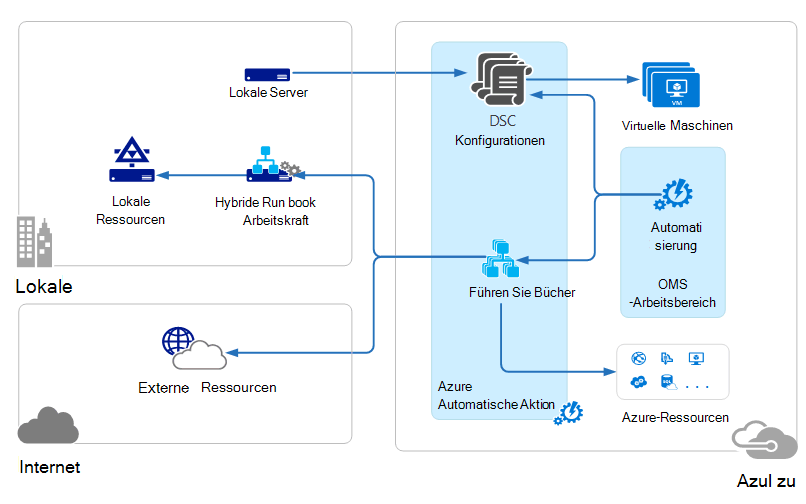

<properties 
   pageTitle="Operations Management Suite (OMS) Architektur | Microsoft Azure"
   description="Microsoft Operations Management Suite (OMS) ist Microsoft Cloud-basierten IT Management Lösung, verwalten und schützen Ihre lokalen und cloud-Infrastruktur.  In diesem Artikel identifiziert OMS andere Dienste und enthält Links zu ausführlichen Inhalt."
   services="operations-management-suite"
   documentationCenter=""
   authors="bwren"
   manager="jwhit"
   editor="tysonn" />
<tags 
   ms.service="operations-management-suite"
   ms.devlang="na"
   ms.topic="get-started-article"
   ms.tgt_pltfrm="na"
   ms.workload="infrastructure-services"
   ms.date="10/27/2016"
   ms.author="bwren" />

# OMS-Architektur

[Operations Management Suite (OMS)](https://azure.microsoft.com/documentation/services/operations-management-suite/) ist eine Sammlung von Cloud-basierte Services für die lokale Verwaltung und cloud-Umgebung.  Dieser Artikel beschreibt verschiedene lokale und Cloud Komponenten von OMS und ihre hohe Ebene Cloud computing-Architektur.  Sie können jeden Dienst Weitere Informationen der Dokumentation verweisen.

## Protokollanalyse

[Protokollanalyse](https://azure.microsoft.com/documentation/services/log-analytics/) alle Daten werden in die OMS-Repository die in Azure gehostet wird.  Verbundene Quellen generiert Daten in OMS-Repository.  Derzeit sind drei Arten von verbundenen Quellen unterstützt.

- Ein Agent installiert auf einem [Windows-](../log-analytics/log-analytics-windows-agents.md) oder [Linux](../log-analytics/log-analytics-linux-agents.md) -Computer direkt mit OMS verbunden.
- Ein System Center Operations Manager (SCOM) Management Gruppe [Protokollanalyse verbunden](../log-analytics/log-analytics-om-agents.md) .  SCOM-Agenten weiterhin mit Verwaltungsservern kommunizieren die Ereignisse und Leistungsdaten an Protokollanalyse.
- Ein [Azure-Speicherkonto](../log-analytics/log-analytics-azure-storage.md) , das [Azure](../cloud-services/cloud-services-dotnet-diagnostics.md) -Diagnosedaten Worker-Rolle, Webrolle oder virtuellen Computer in Azure erfasst.

Datenquellen definieren, die von Protokollanalyse verbundenen Quellen einschließlich Ereignisprotokollen und Leistungsindikatoren gesammelten Daten.  Solutions funktionell OMS und können leicht in den Arbeitsbereich von [OMS Lösungskatalog](../log-analytics/log-analytics-add-solutions.md)hinzugefügt werden.  Lösungsansätze erfordern eine direkte Verbindung zu Protokollanalyse von SCOM-Agenten während andere erfordert einen zusätzlichen Agent installiert sein.

Protokollanalyse wurde eine Web-basierte Portal, mit denen Sie OMS-Ressourcen, hinzufügen und konfigurieren OMS Solutions anzeigen und Analysieren von Daten im Repository OMS.

## Azure-Automatisierung

[Azure Automation Runbooks](http://azure.microsoft.com/documentation/services/automation) in Azure-Cloud ausgeführt werden und Zugriff auf Ressourcen, die in Azure in andere Cloud-Dienste oder vom öffentlichen Internet zugänglich sind.  Sie können auch auf lokalen Computer festlegen, im lokalen Rechenzentrum mit [Hybrid Runbook Worker](../automation/automation-hybrid-runbook-worker.md) Runbooks auf lokale Ressourcen zugreifen können.

Gespeichert in Azure Automation [DSC-Konfigurationen](../automation/automation-dsc-overview.md) können Azure virtuellen Maschinen direkt angewendet werden.  Anderen physischen und virtuellen Computern können Konfigurationen von Azure Automation DSC Pull-Server anfordern.

Azure Automatisierung hat eine OMS-Lösung, die Statistiken und Links zum Azure-Portal für alle Vorgänge starten angezeigt.

## Azure Backup

Geschützte Daten in [Azure Backup](http://azure.microsoft.com/documentation/services/backup) befindet sich in einem backup in einem bestimmten geografischen Gebiet befindet.  Die Daten in derselben Region repliziert und je Depot können auch repliziert werden andere Region weitere Redundanz.

Azure Backup verfügt über drei grundlegende Szenarien.

- Windows-Computer mit Azure Backup-Agent.  Dadurch können Sie Dateien und Ordner von WindowsServer oder Client direkt auf den Azure backup-Tresor.  
- System Center Data Protection Manager (DPM) oder Microsoft Azure Backup-Server. Dadurch können Sie DPM oder Microsoft Azure Backup-Server zu sichern, Dateien und Ordner neben Anwendungsworkloads wie SQL und SharePoint in den lokalen Speicher replizieren in Azure backup Vault nutzen.
- Azure Virtual Machine Extensions.  Dadurch werden Azure virtuelle Maschinen Azure backup Vault sichern.

Azure Backup hat eine OMS-Lösung, die Statistiken und Links zum Azure-Portal für alle Vorgänge starten angezeigt.

## Azure Site Recovery

[Azure Site Recovery](http://azure.microsoft.com/documentation/services/site-recovery) orchestriert Replikation, Failover und Failback von virtuellen Computern und Servern. Replikation zwischen Hyper-V-Hosts VMware-Hypervisoren und in Rechenzentren von primären und sekundären physischen Server oder zwischen dem Rechenzentrum und den Azure-Speicher Datenaustausch.  Site Recovery speichert Metadaten in Depots in einer bestimmten geografischen Region Azure befindet. Site Recovery-Dienst keine replizierten Daten gespeichert.

Azure Site Recovery hat drei grundlegende Replikationsszenarien.

**Replikation von Hyper-V virtuelle Computer**
- Wenn Hyper-V virtuelle Computer in VMM-Clouds verwaltet werden, können Sie einen sekundären Rechenzentrum oder Azure-Speicher replizieren.  Replikation in Azure ist über eine sichere Internetverbindung.  Replikation in einem sekundären Datencenter ist über das LAN.
- Wenn Hyper-V virtuelle Computer nicht von VMM verwaltet können Sie Azure-Speicher replizieren.  Replikation in Azure ist über eine sichere Internetverbindung.
 
**Replikation von virtuellen Maschinen von VMWare**
- Virtuelle VMware-Maschinen können in einem sekundären Datencenter mit VMware und Azure-Speicher repliziert werden.  Replikation in Azure kann ein Standort-zu-Standort-VPN oder Azure ExpressRoute oder über eine sichere Internetverbindung auftreten. In einem zweiten Datencenter Replikation über InMage Scout-Datenkanal.
 
**Replikation von Windows- und Linux-Servern** 
- Sie können physische Server in einem sekundären Datencenter oder Azure-Speicher replizieren. Replikation in Azure kann ein Standort-zu-Standort-VPN oder Azure ExpressRoute oder über eine sichere Internetverbindung auftreten. In einem zweiten Datencenter Replikation über InMage Scout-Datenkanal.  Azure Site Recovery hat eine OMS-Lösung, die einige Statistiken zeigt jedoch Azure-Portal muss für alle Vorgänge verwendet.

## Nächste Schritte

- Erfahren Sie [Protokollanalyse](http://azure.microsoft.com/documentation/services/log-analytics).
- Erfahren Sie mehr über [Azure Automation](https://azure.microsoft.com/documentation/services/automation).
- Erfahren Sie mehr über [Azure Backup](http://azure.microsoft.com/documentation/services/backup).
- Erfahren Sie mehr über [Azure Site Recovery](http://azure.microsoft.com/documentation/services/site-recovery).
