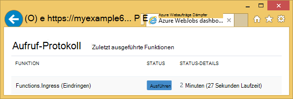
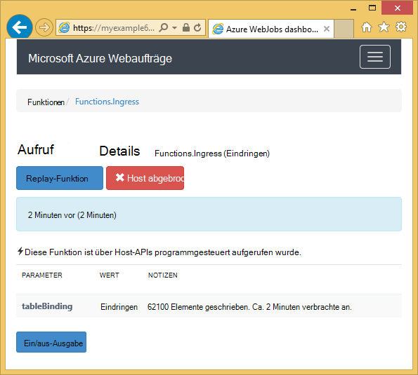

<properties
    pageTitle="Erste Schritte mit Azure-Speicher und Visual Studio verbunden Services (Webauftrags Projekte)"
    description="Einstieg in Azure Table Storage in einem Webaufträge Azure-Projekt in Visual Studio nach dem Anschließen an ein Speicherkonto mit Visual Studio verbunden services"
    services="storage"
    documentationCenter=""
    authors="TomArcher"
    manager="douge"
    editor=""/>

<tags
    ms.service="storage"
    ms.workload="web"
    ms.tgt_pltfrm="vs-getting-started"
    ms.devlang="na"
    ms.topic="article"
    ms.date="07/18/2016"
    ms.author="tarcher"/>

# Erste Schritte mit Azure Storage (Azure Webauftrags Projekte)

[AZURE.INCLUDE [storage-try-azure-tools-tables](../../includes/storage-try-azure-tools-tables.md)]

## Übersicht

Dieser Artikel stellt C# Code-Beispiele, die zeigen Verwendungsmöglichkeiten von Azure Webaufträge SDK Version 1.x Azure Table Storage Service. Die Codebeispiele verwenden die [Webaufträge SDK](../app-service-web/websites-dotnet-webjobs-sdk.md) -Version 1.x.

Azure Table Storage Service können Sie große Mengen von strukturierten Daten. Der Dienst ist ein NoSQL-Datenspeicher, der authentifizierte Aufrufe von innerhalb und außerhalb der Azure-Cloud akzeptiert. Azure-Tabellen eignen sich zum Speichern von strukturierten, nicht-relationalen Daten.  Weitere Informationen finden Sie unter [Erste Schritte mit Azure Table Storage mit .NET](storage-dotnet-how-to-use-tables.md#create-a-table) .

Einige Codeausschnitte zeigen des Attributs der **Tabelle** Funktionen, die nicht mithilfe eines Triggers Attribute manuell, d. h. aufgerufen werden.

## Entitäten zu einer Tabelle hinzufügen

Um Entitäten zu einer Tabelle hinzuzufügen, verwenden Sie das Attribut der **Tabelle** mit einer **ICollector<T> ** oder **IAsyncCollector<T> ** Parameter **T** gibt, das Schema der Entitäten, die Sie hinzufügen möchten. Der Attributkonstruktor hat einen Zeichenfolgenparameter, der den Namen der Tabelle angibt.

Im folgenden Beispiel hinzugefügt Tabelle *Eindringen* **Person** Entitäten.

        [NoAutomaticTrigger]
        public static void IngressDemo(
            [Table("Ingress")] ICollector<Person> tableBinding)
        {
            for (int i = 0; i < 100000; i++)
            {
                tableBinding.Add(
                    new Person() {
                        PartitionKey = "Test",
                        RowKey = i.ToString(),
                        Name = "Name" }
                    );
            }
        }

In der Regel die **ICollector** verwendeten **TableEntity** abgeleitet oder implementiert **ITableEntity**jedoch nicht. Eine der folgenden **Person** -Klassen arbeiten mit Code im vorangehenden **Ingress** -Methode.

        public class Person : TableEntity
        {
            public string Name { get; set; }
        }

        public class Person
        {
            public string PartitionKey { get; set; }
            public string RowKey { get; set; }
            public string Name { get; set; }
        }

Wenn Sie direkt mit den Azure-Speicher-API arbeiten möchten, können Sie die Methodensignatur **CloudStorageAccount** Parameter hinzufügen.

## Echtzeit-Überwachung

Da Eindringen Funktionen häufig große Datenmengen verarbeiten, bietet WebJobs SDK Dashboard Echtzeit-Daten. Abschnitt **Aufruf** erfahren, ob die Funktion weiterhin ausgeführt wird.

Die **Aufruf** Detailseite Fortschrittsberichte der Funktion (Anzahl der Entitäten geschrieben) wird ausgeführt und gibt Ihnen die Möglichkeit, ihn abzubrechen.

Nach Abschluss die Funktion meldet die **Aufrufs** Seite die Anzahl der geschriebenen Zeilen.

## Mehrere Elemente aus einer Tabelle lesen

Um eine Tabelle zu lesen, verwenden Sie das Attribut der **Tabelle** mit einer **IQueryable<T> ** Parameter, **T** **TableEntity** abgeleitet oder implementiert **ITableEntity**.

Das folgende Codebeispiel liest und alle Zeilen aus der Tabelle **Eindringen** protokolliert:

        public static void ReadTable(
            [Table("Ingress")] IQueryable<Person> tableBinding,
            TextWriter logger)
        {
            var query = from p in tableBinding select p;
            foreach (Person person in query)
            {
                logger.WriteLine("PK:{0}, RK:{1}, Name:{2}",
                    person.PartitionKey, person.RowKey, person.Name);
            }
        }

### Eine Einheit einer Tabelle lesen

Gibt es eine **Tabelle** Attributkonstruktor mit zwei zusätzliche Parameter der Partition und Zeilenschlüssel angeben, wenn für eine einzelne Tabelle Person binden.

Das folgende Codebeispiel liest eine Tabellenzeile für eine **Person** -Entität basierend auf Partition Schlüssel und Zeile Schlüsselwerte in einer Warteschlange erhalten haben:  

        public static void ReadTableEntity(
            [QueueTrigger("inputqueue")] Person personInQueue,
            [Table("persontable","{PartitionKey}", "{RowKey}")] Person personInTable,
            TextWriter logger)
        {
            if (personInTable == null)
            {
                logger.WriteLine("Person not found: PK:{0}, RK:{1}",
                        personInQueue.PartitionKey, personInQueue.RowKey);
            }
            else
            {
                logger.WriteLine("Person found: PK:{0}, RK:{1}, Name:{2}",
                        personInTable.PartitionKey, personInTable.RowKey, personInTable.Name);
            }
        }

Die **Person** -Klasse in diesem Beispiel hat keinen **ITableEntity**implementieren.

## Wie Sie die .NET-API direkt in Tabellen

Auch können das Attribut der **Tabelle** mit einem **CloudTable** -Objekt mehr Flexibilität mit einer Tabelle arbeiten.

Das folgende Codebeispiel verwendet ein **CloudTable** Objekt *Eindringen* Tabelle eine einzelne Entität hinzu.

        public static void UseStorageAPI(
            [Table("Ingress")] CloudTable tableBinding,
            TextWriter logger)
        {
            var person = new Person()
                {
                    PartitionKey = "Test",
                    RowKey = "100",
                    Name = "Name"
                };
            TableOperation insertOperation = TableOperation.Insert(person);
            tableBinding.Execute(insertOperation);
        }

Weitere Informationen zur Verwendung des **CloudTable** -Objekts finden Sie unter [Erste Schritte mit Azure Table Storage mit .NET](storage-dotnet-how-to-use-tables.md).

## Die Warteschlangen Artikel Verwandte Themen

Informationen zur Behandlung von Tabelle Verarbeitung ausgelöst durch eine Meldung Warteschlange oder WebJobs SDK Szenarien nicht spezifisch für die Tabelle Verarbeitung, siehe [erste Azure Queue Storage mit Visual Studio verbunden (Webauftrags Projekte) gestartet](vs-storage-webjobs-getting-started-queues.md).

## Nächste Schritte

Dieser Artikel hat Codebeispiele, die für die Arbeit mit Azure Standardszenarien veranschaulichen. Weitere Informationen zur Verwendung von Azure Webaufträge und WebJobs SDK finden Sie unter [Azure Webaufträge Dokumentationsressourcen](http://go.microsoft.com/fwlink/?linkid=390226).
