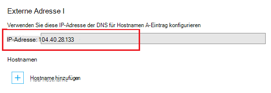

Domain Name System (DNS) wird verwendet, um Ressourcen im Internet zu suchen. Wenn Sie eine app Webadresse im Browser eingeben oder auf einen Link auf einer Webseite, beispielsweise sie DNS Domäne in eine IP-Adresse übersetzt. Ist die IP-Adresse wie eine Adresse, aber ist nicht sehr menschenfreundlich. Beispielsweise ist es einfacher an einen DNS-Namen wie **"contoso.com"** als eine IP-Adresse wie 192.168.1.88 oder 2001:0:4137:1f67:24a2:3888:9cce:fea3 ist.

Die DNS- *Datensätze*basiert. Datensätze ordnen einen bestimmten *Namen*, z. B. **contoso.com**eine IP-Adresse oder einen anderen DNS-Namen. Wenn eine Anwendung z. B. ein Webbrowser einen Namen im DNS sucht, findet den Datensatz und verwendet was es an die Adresse. Der Wert weist auf eine IP-Adresse ist, wird der Browser Wert verwenden. Weist einen anderen DNS-Namen, muss die Anwendung die Auflösung wiederholen. Schließlich werden alle Auflösung eine IP-Adresse enden.

Beim Erstellen einer Web-app in App Service ist ein DNS-Name der Web app automatisch zugewiesen. Dieser Name hat die Form ** &lt;Yourwebappname&gt;. *.azurewebsites.NET**. Wird auch eine virtuelle IP-Adresse zur Verwendung erstellen DNS Datensätze entweder Datensätze erstellen, die auf die **. *.azurewebsites.NET**, oder die IP-Adresse auf.

> [AZURE.NOTE] Die IP-Adresse Ihrer Anwendung ändert, wenn löschen und Ihrer Anwendung erstellen oder App Service planmodus **frei** ändern, nachdem sie **grundlegende**, **Shared**oder **Standard**festgelegt wurde.

Gibt es auch mehrere Typen von Datensätzen, mit Funktionen und Grenzen, aber für Web-apps wir nur kümmern zwei *A-* und *CNAME* -Einträge.

###Datensatz (Record)

Ein A-Datensatz ordnet eine Domäne **contoso.com** oder **www.contoso.com** *oder eine Platzhalterdomäne* wie ** \*. contoso.com**, eine IP-Adresse. Bei einer Web-app in App Service Adresse die virtuelle IP-Adresse des Dienstes oder einer bestimmten IP-, die Sie für Ihre Web gekauft.

Die Hauptvorteile von einen A-Datensatz über einen CNAME-Eintrag sind:

* Sie können eine IP-Adresse eine Stammdomäne z. B. **contoso.com** zuordnen; Viele Registrierstellen können nur mit einem Datensätze

* Ein Eintrag, der einen Platzhalter wie verwendet haben ** \*. contoso.com**, behandelt die Anfragen für mehrere untergeordnete Domänen wie **"Mail.contoso.com"**, **blogs.contoso.com**oder **www.contso.com**.

> [AZURE.NOTE] Da eine statische IP-Adresse ein A-Datensatz zugeordnet ist, kann es automatisch ändert die IP-Adresse von Ihrer Anwendung nicht auflösen. Eine IP-Adresse mit einem Datensätze wird bereitgestellt, wenn Sie benutzerdefinierte Domain Name für Ihre Webanwendung konfigurieren. Dieser Wert kann jedoch ändern, löschen und neu erstellen Ihrer Anwendung oder die App Service Plan Modus wieder **frei**.

###Aliaseintrag (CNAME-Datensatz)

Ein CNAME-Eintrag ordnet einen *bestimmten* DNS-Namen **www.contoso.com**oder **mail.contoso.com** eines anderen Domänennamens (kanonisch). Bei App Service Web Apps kanonische Domänenname ist die ** &lt;Yourwebappname >. *.azurewebsites.NET** Domänennamen Ihrer Anwendung. Nach dem Erstellen der CNAME-Eintrag erstellt einen Alias für die ** &lt;Yourwebappname >. *.azurewebsites.NET** Domänennamen. CNAME-Eintrag wird die IP-Adresse auflösen der ** &lt;Yourwebappname >. *.azurewebsites.NET** Domänenname, so ändert die IP-Adresse der Web-app haben Sie keinen ergreifen.

> [AZURE.NOTE] Domain-Registrierer können nur Unterdomänen zugeordnet, wenn ein CNAME-Eintrag wie **www.contoso.com**nicht Root Namen **contoso.com**verwenden. Weitere Informationen auf CNAME-Einträge finden Sie in der Dokumentation Ihrer Registrierungsstelle, <a href="http://en.wikipedia.org/wiki/CNAME_record">Wikipedia-Eintrag CNAME-Datensatz</a>oder dem Dokument <a href="http://tools.ietf.org/html/rfc1035">IETF Domain Names - Implementation and Specification</a> .

###Web app DNS-Besonderheiten

Einen A-Datensatz müssen für Web Apps Sie zunächst einen der folgenden TXT-Datensätze erstellen:

* **Für die Stammdomäne** – ein DNS-TXT-Datensatz **@** , ** &lt;Yourwebappname&gt;. *.azurewebsites.NET**.

* **Für eine untergeordnete Domäne** – eine DNS-Namen des ** &lt;Unterdomäne >** , ** &lt;Yourwebappname&gt;. *.azurewebsites.NET**. Z. B. **Blogs** ist der A-Datensatz für **blogs.contoso.com**.

* **Für Platzhalter Sub-Dodmains** – ein DNS-TXT-Datensatz ***, ** &lt;Yourwebappname&gt;. *.azurewebsites.NET**.

TXT-Eintrag wird zum bestätigen, dass die Domäne, die Sie verwenden möchten. Dies ist neben einem A-Eintrag auf die virtuelle IP-Adresse Ihrer Anwendung.

Finden Sie die IP-Adresse und **. *.azurewebsites.NET** Namen für Ihre Webanwendung durch Ausführen der folgenden Schritte:

1. Öffnen Sie in Ihrem Browser [Azure-Portal](https://portal.azure.com).

2. **Web Apps** -Blatt klicken Sie auf den Namen Ihrer Anwendung, und wählen Sie **benutzerdefinierte Domänen** vom unteren Rand der Seite.

    

3. Blatt **Custom Domains** sehen Sie die virtuelle IP-Adresse. Speichern Sie diese Informationen verwendet werden, beim Erstellen von DNS-Datensätzen

    

    > [AZURE.NOTE] Sie können keine benutzerdefinierten Domänennamen mit einer **frei** Web app und App Serviceplan **Shared**, **Basic**, **Standard**oder **Premium** -Ebene aktualisieren müssen. Weitere Informationen zu App Service-Plan Preise Ebenen wie Tarif Ihrer Anwendung ändern, [wie webapps](../articles/web-sites-scale.md)angezeigt.
